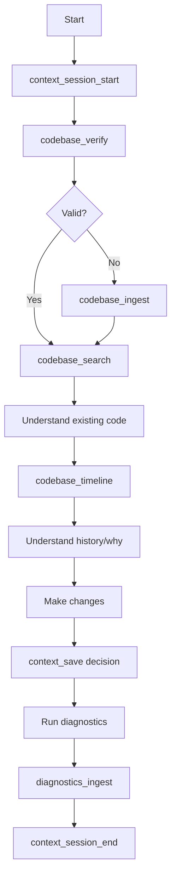
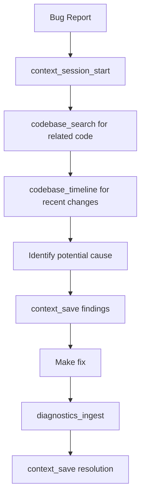
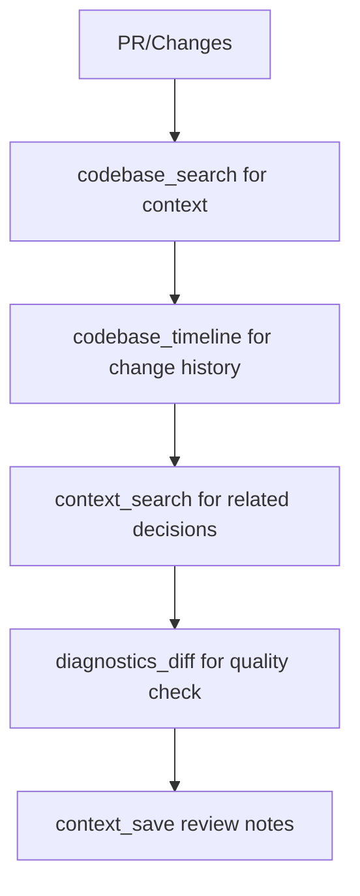
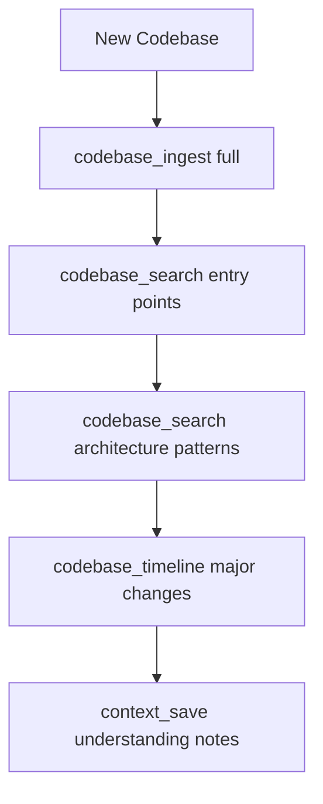

# Agent Workflow Patterns for ping-mem

This document provides detailed workflow patterns for AI agents using ping-mem.

---

## Quick Reference

| Operation | Tool | Example |
|-----------|------|---------|
| Start session | `context_session_start` | `{ name: "feature-x" }` |
| Check manifest | `codebase_verify` | `{ projectDir: "..." }` |
| Index codebase | `codebase_ingest` | `{ projectDir: "..." }` |
| Search code | `codebase_search` | `{ query: "auth logic" }` |
| Get history | `codebase_timeline` | `{ projectId: "..." }` |
| Save decision | `context_save` | `{ key: "...", value: "...", category: "decision" }` |
| Health check | `context_health` | `{}` |

---

## Workflow 1: New Feature Development



### Step-by-Step

1. **Initialize Session**
   ```json
   context_session_start({
     "name": "feature-user-auth",
     "projectDir": "/path/to/project"
   })
   ```

2. **Verify Codebase State**
   ```json
   codebase_verify({
     "projectDir": "/path/to/project"
   })
   ```
   - If `valid: false`, run `codebase_ingest`

3. **Search Relevant Code**
   ```json
   codebase_search({
     "query": "user authentication middleware",
     "type": "code",
     "limit": 10
   })
   ```

4. **Understand History**
   ```json
   codebase_timeline({
     "projectId": "abc123",
     "filePath": "src/auth/middleware.ts",
     "limit": 20
   })
   ```

5. **Record Decision**
   ```json
   context_save({
     "key": "auth-strategy-choice",
     "value": "Using JWT with refresh tokens because of stateless scalability requirements",
     "category": "decision",
     "priority": "high",
     "extractEntities": true
   })
   ```

6. **Track Diagnostics** (after making changes)
   ```json
   diagnostics_ingest({
     "projectId": "abc123",
     "treeHash": "...",
     "toolName": "tsc",
     "toolVersion": "5.3.3",
     "configHash": "...",
     "sarif": {...}
   })
   ```

---

## Workflow 2: Bug Investigation



### Step-by-Step

1. **Search for Bug Location**
   ```json
   codebase_search({
     "query": "user login fails when email contains plus sign",
     "type": "code"
   })
   ```

2. **Check Recent Changes**
   ```json
   codebase_timeline({
     "projectId": "...",
     "filePath": "src/auth/validators.ts",
     "limit": 10
   })
   ```

3. **Record Findings**
   ```json
   context_save({
     "key": "bug-123-investigation",
     "value": "Root cause: email regex doesn't allow + character. Introduced in commit abc123.",
     "category": "progress",
     "extractEntities": true
   })
   ```

4. **Record Resolution**
   ```json
   context_save({
     "key": "bug-123-resolution",
     "value": "Fixed by updating email regex to RFC 5322 compliant pattern",
     "category": "decision"
   })
   ```

---

## Workflow 3: Code Review



### Step-by-Step

1. **Understand Changed Code Context**
   ```json
   codebase_search({
     "query": "payment processing stripe integration",
     "filePath": "src/payments/",
     "type": "code"
   })
   ```

2. **Check History of Changed Files**
   ```json
   codebase_timeline({
     "projectId": "...",
     "filePath": "src/payments/stripe.ts"
   })
   ```

3. **Find Related Past Decisions**
   ```json
   context_search({
     "query": "payment provider decision stripe"
   })
   ```

4. **Compare Diagnostics**
   ```json
   diagnostics_diff({
     "analysisIdA": "before-pr",
     "analysisIdB": "after-pr"
   })
   ```

---

## Workflow 4: Onboarding / Understanding New Codebase



### Step-by-Step

1. **Full Ingestion**
   ```json
   codebase_ingest({
     "projectDir": "/path/to/new-project",
     "forceReingest": true
   })
   ```

2. **Find Entry Points**
   ```json
   codebase_search({
     "query": "main entry point application bootstrap",
     "type": "code",
     "limit": 5
   })
   ```

3. **Understand Architecture**
   ```json
   codebase_search({
     "query": "dependency injection service container",
     "type": "code"
   })
   ```

4. **See Major Changes**
   ```json
   codebase_timeline({
     "projectId": "...",
     "limit": 100
   })
   ```

5. **Record Understanding**
   ```json
   context_save({
     "key": "codebase-architecture-notes",
     "value": "Clean architecture with domain/application/infrastructure layers...",
     "category": "note",
     "extractEntities": true
   })
   ```

---

## Anti-Patterns to Avoid

### 1. Using grep Instead of codebase_search

**Wrong:**
```bash
rg "function authenticate" --type ts
```

**Right:**
```json
codebase_search({
  "query": "authentication function",
  "type": "code"
})
```

### 2. Using git log Instead of codebase_timeline

**Wrong:**
```bash
git log --oneline -20 src/auth.ts
```

**Right:**
```json
codebase_timeline({
  "projectId": "...",
  "filePath": "src/auth.ts",
  "limit": 20
})
```

### 3. Not Recording Decisions

**Wrong:**
- Making architectural decisions without documentation
- Relying on memory for past decisions

**Right:**
```json
context_save({
  "key": "database-choice-2024",
  "value": "Chose PostgreSQL over MySQL for JSONB support and better TypeScript ORM compatibility",
  "category": "decision",
  "priority": "high",
  "extractEntities": true
})
```

### 4. Skipping Health Checks

**Wrong:**
- Assuming services are available
- Not verifying connectivity

**Right:**
```json
context_health({})
```
Check response for:
- `status: "healthy"` or `"degraded"`
- All components showing `configured: true`

---

## Best Practices

1. **Always start with codebase_verify** before searching
2. **Use specific queries** - "JWT token validation" not just "auth"
3. **Record all decisions** with `extractEntities: true`
4. **Check timeline** before making changes to understand context
5. **Run diagnostics** after changes and compare with `diagnostics_diff`
6. **Use categories appropriately**:
   - `decision` - Architectural choices
   - `task` - Current work items
   - `progress` - Investigation notes
   - `note` - General observations

---

## See Also

- [AGENT_INSTRUCTIONS.md](../AGENT_INSTRUCTIONS.md) - Mandatory agent instructions
- [CLAUDE.md](../CLAUDE.md) - Full project documentation
- [.cursorrules](../.cursorrules) - Cursor IDE rules
