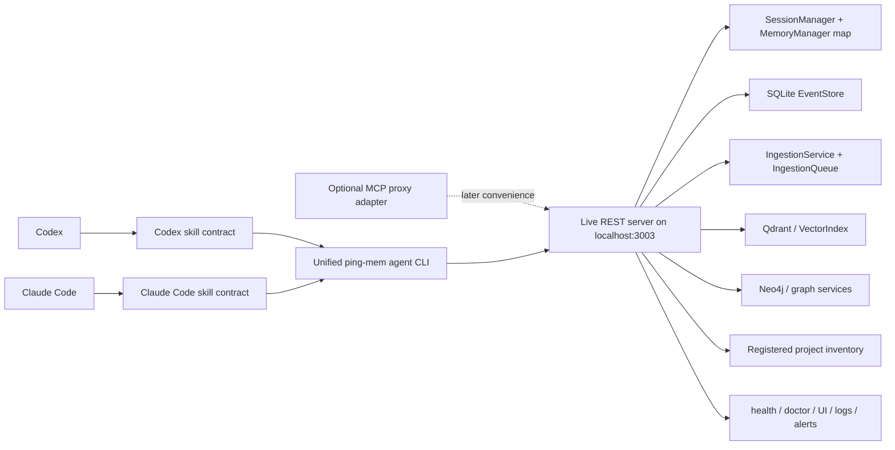
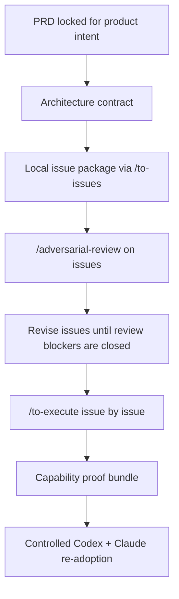
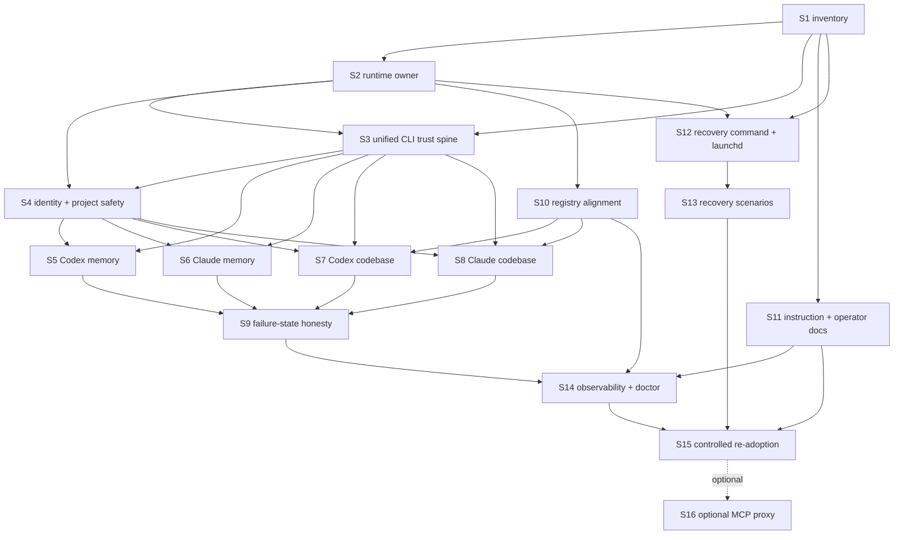

# Architecture: ping-mem Ground-Up Local Trust Rebuild

**Date:** 2026-04-29
**Status:** Revised architecture candidate; requires fresh `/adversarial-review` before `/to-issues`
**Source PRD:** `docs/prds/2026-04-29-ground-up-local-trust-rebuild.md`
**Scope:** local deterministic trust rebuild for Codex and Claude Code only

## Architecture Summary

ping-mem's rebuild centers on one product rule:

> Codex and Claude Code may only trust ping-mem when their real local paths reach the same live runtime, carry explicit project/agent/session identity, and prove memory and codebase behavior end to end.

The approved architecture is a **single live REST/runtime owner** with a shared deterministic agent adapter.



MCP is not the only way to reach ping-mem. The repo already exposes a REST API, and the REST/server process is the authoritative runtime boundary. The first approved re-adoption path should therefore be a rebuilt **unified `ping-mem agent` CLI plus a small Codex/Claude skill contract**. Both Codex and Claude Code can run the same command surface, capture the same JSON proof, carry the same project/agent/session identity, and fail with the same exit codes.

MCP proxy remains a useful agent-native convenience adapter, but it is not the first trust spine. It can be re-enabled later only if it proves the same REST ownership, auth, identity, no-auto-repair, and evidence contracts as the CLI. Existing direct MCP database mode remains available only as offline or isolated development machinery. It is not an approved agent path for re-adoption because it can open its own runtime and database state outside the live server.

This architecture intentionally steps beyond the current implementation shape: it keeps REST as the core product API, makes the CLI the deterministic trust harness that both agents can share, and treats MCP as an optional wrapper after the core capabilities are trustworthy.

## Goals And Non-Goals

### Goals

- Preserve PRD `OBJ-1` through `OBJ-8`, `OUT-1` through `OUT-8`, and `CAP-1` through `CAP-8`.
- Define one owner for active writes, sessions, memory state, codebase indexes, and project registry truth.
- Define allowed Codex and Claude Code entrypoints after quarantine.
- Require explicit project, agent, and session identity for approved stateful paths.
- Separate product capability proof from smoke scripts and health checks.
- Convert every broad claim into a finite population plus proof level.

### Non-Goals

- Multi-user tenancy, teams, hosted SaaS, OAuth, billing, or public packaging.
- OpenCode, Cursor, generic MCP clients, or "all agents."
- UI redesign beyond truthful capability/status states needed by `CAP-7`.
- Autonomous repair as the default acceptance behavior.
- Re-adopting ping-mem as default infrastructure before the proof gate passes.

## Goal Contract Traceability

| PRD ID | Architecture responsibility |
|---|---|
| `OBJ-1`, `OUT-1`, `CAP-8` | Keep ping-mem quarantined until the approved Codex and Claude paths pass operational proof. |
| `OBJ-2`, `OUT-2`, `CAP-4` | Prove memory lifecycle through each approved path: save, search, retrieve, update/supersede, delete, recall. |
| `OBJ-3`, `OUT-3`, `CAP-5` | Prove codebase verify, ingest, search, timeline/evidence anchors on selected real repos. |
| `OBJ-4`, `OUT-4`, `CAP-1` | Enforce live REST/runtime ownership; classify direct DB mode as offline/dev only. |
| `OBJ-5`, `OUT-5`, `CAP-3` | Require explicit `projectDir` or project identity, `agentId`, and `sessionId`/`X-Session-ID`. |
| `OBJ-6`, `OUT-6`, `CAP-6` | Define recovery scenarios as tested events with bounded failure interpretation. |
| `OBJ-7`, `OUT-7`, `CAP-7` | Align health, doctor, UI, logs, and alerts to the same capability truth model. |
| `OBJ-8`, `OUT-8`, `CAP-8` | Make re-adoption a controlled rollout with backups, diffs, and rollback. |

## Evidence Ledger

| Claim | Evidence | Architecture consequence |
|---|---|---|
| Product promise is persistent memory, codebase intelligence, and cross-project awareness for agents. | `README.md:1-8` | Trust rebuild must prove memory and codebase grounding, not only server health. |
| Agent-facing surface includes REST, MCP, CLI, SDK, and tool discovery. | `README.md:10-20` | Phase 0 must inventory entrypoints, then approve only the subset in PRD scope. |
| Context memory tools include session start/end, save, get, search, delete, checkpoint, status. | `README.md:55-67` | Memory proof must exercise lifecycle behavior, not just one save/search path. |
| Codebase intelligence tools include ingest, verify, search, timeline, project listing, and dependency views. | `README.md:79-90` | Codebase proof must require source anchors and current project truth. |
| The intended runtime shape is one server on port 3003 with REST, MCP, OpenAPI, health, UI, admin, and static routes. | `README.md:152-180` | Single runtime owner is consistent with documented system shape. |
| README recommends Claude Code proxy mode to avoid direct SQLite access. | `README.md:227-253` | Proxy mode is safer than direct MCP, but this does not make MCP the only or first approved path. |
| `proxy-cli` is stateless and forwards MCP tool calls to the REST server. | `src/mcp/proxy-cli.ts:1-7`, `src/mcp/proxy-cli.ts:109-199` | Proxy mode is a candidate convenience adapter after the CLI/REST trust spine proves the product contract. |
| Direct MCP server constructs its own service state and warns about direct DB mode without `PING_MEM_REST_URL`. | `src/mcp/PingMemServer.ts:209-234`, `src/mcp/PingMemServer.ts:404-424` | Direct mode is not an approved live agent path. |
| REST session start creates the session and session-scoped `MemoryManager`. | `src/http/rest-server.ts:784-838` | REST server owns active session/memory manager lifecycle. |
| REST context save/update require a session via request resolution. | `src/http/rest-server.ts:901-935`, `src/http/rest-server.ts:1018-1069` | Approved clients must carry session identity. |
| REST codebase ingest/verify/search route through `IngestionService` and `IngestionQueue`. | `src/http/rest-server.ts:1235-1380` | Codebase proof should exercise live ingestion/search state through REST-owned services. |
| REST tool invocation is an admin-authenticated gateway to MCP tool modules. | `src/http/rest-server.ts:3842-3995` | MCP proxy and CLI proof commands must use runtime gateways without exposing secrets in repo artifacts. |
| REST session fallback still exists when no `X-Session-ID` is present. | `src/http/rest-server.ts:4100-4149` | Re-adoption must forbid relying on fallback for approved paths. |
| MemoryManager is the core memory lifecycle component and supports agent scoping. | `src/memory/MemoryManager.ts:1-5`, `src/memory/MemoryManager.ts:58-80`, `src/memory/MemoryManager.ts:210-259` | Identity contract must wire agent identity into managers and memory events. |
| EventStore is SQLite append-only storage with WAL defaults. | `src/storage/EventStore.ts:1-5`, `src/storage/EventStore.ts:52-57`, `src/storage/EventStore.ts:185-230` | Active writes must be centralized to avoid split-brain/direct-writer ambiguity. |
| Registered project truth can come from env, `/data/registered-projects.txt`, or `~/.ping-mem`. | `src/ingest/registered-projects.ts:14-23`, `src/ingest/registered-projects.ts:98-123` | Runtime inventory source must be named and tested in the live container context. |
| Several maintenance scripts can write or inspect runtime data outside REST ownership. | `scripts/direct-ingest.ts:13-15`, `scripts/force-ingest.ts:5-18`, `scripts/reindex-qdrant.ts:6-30`, `scripts/migrate-from-memory-keeper.ts:20-22`, `scripts/migrate-from-memory-keeper.ts:39-42`, `scripts/migrate-from-memory-keeper.ts:62-71` | Runtime ownership must quarantine these as `offline-maintenance-only` or `blocked` for acceptance, recovery, and re-adoption paths. |
| Existing agent audit script still uses direct `dist/mcp/cli.js`. | `scripts/agent-path-audit.sh:19-32` | Existing proof scripts are not accepted as-is for re-adoption; issue slices must replace or constrain this path. |
| Current Codex static config has MCP servers for Context7 and Pencil, but no ping-mem server. | `/Users/umasankr/.codex/config.toml:17-22` | Static config alone is insufficient; phase 0 must also inventory live processes and app-level state. |
| Live Codex app-server processes are currently spawning `bun run /Users/umasankr/Projects/ping-mem/dist/mcp/proxy-cli.js` children. | `ps -axo pid,ppid,command \| rg 'Codex\\.app\|app-server\|ping-mem/dist/mcp/proxy-cli\|dist/mcp/proxy-cli\|dist/mcp/cli'` on 2026-04-29 | Codex cannot be claimed quarantined until active process state is classified and stopped, explained, or proven harmless. |
| Current CLI `session start` accepts `projectDir` but no `agentId`. | `src/cli/commands/session.ts:10-27` | Current CLI cannot be accepted as the trust spine until agent identity is explicit. |
| Current CLI context commands accept `sessionId` as body/query data, but the thin CLI client does not send `X-Session-ID`. | `src/cli/commands/context.ts:10-123`, `src/cli/client.ts:26-34` | Current CLI cannot prove session identity against REST routes that resolve sessions from headers. |
| REST SDK already has a `currentSessionId` header mechanism. | `src/client/rest-client.ts:202-237` | The unified CLI should reuse or mirror this session-header behavior instead of inventing a second session path. |
| Current CLI codebase `projects` command does not expose `scope=registered`, while `timeline` and `projects` are part of the advertised codebase surface. | `src/cli/commands/codebase.ts:62-93`, `src/mcp/handlers/CodebaseToolModule.ts:78-92` | Codebase proof must include verify, ingest, search, timeline, project inventory with `scope=registered`, and source anchors. |
| REST `/api/v1/codebase/verify` resolves `projectDir` and calls `verifyProject` without the MCP path-safety check. | `src/http/rest-server.ts:1327-1344`, `src/mcp/handlers/CodebaseToolModule.ts:242-250` | Unified CLI codebase proof must include REST verify path-safety parity and negative tests for unsafe project paths. |
| Package scripts and binary exports still expose direct MCP mode. | `package.json:7-10`, `package.json:41-42` | Direct-mode reintroduction must be inventoried and guarded before re-adoption. |
| Installer still emits direct MCP configs for Cursor and Claude Code. | `scripts/install-client.sh:171-184`, `scripts/install-client.sh:201-210` | Installer output is a direct-mode offender and must not be used for re-adoption without a proxy update. |
| REST and MCP schemas currently make identity optional. | `src/validation/api-schemas.ts:20-26`, `src/mcp/handlers/ContextToolModule.ts:43-56` | Identity gates must be implemented and negatively tested, not only documented. |
| UI ingestion reads `~/.ping-mem/registered-projects.txt` directly. | `src/http/ui/ingestion.ts:25-37`, `src/http/ui/partials/ingestion.ts:78-106` | UI/status project inventory must be routed through runtime registry truth. |
| Proxy startup currently attempts to start Docker when REST health is unreachable. | `src/mcp/proxy-cli.ts:67-80`, `src/mcp/proxy-cli.ts:225-229` | Approved adapters must not auto-repair during read-only proof or re-adoption startup. |
| Active ping-mem LaunchAgents include daemon, doctor, periodic-cognition, periodic-ingest, soak-monitor, and system-ready jobs. Doctor and system-ready embed known default admin credentials; system-ready and periodic-ingest target scripts absent from clean main. | `find /Users/umasankr/Library/LaunchAgents -maxdepth 1 -name 'com.ping-mem*.plist' -print \| sort` plus `plutil -p`; missing targets checked with `rg --files scripts config launchagents` on 2026-04-29 | Recovery proof needs a repo-owned status command plus full launchd disposition, credential hygiene, target-existence proof, and rollback before scenarios are executable. |
| Root agent-facing instructions still tell agents to use ping-mem directly during normal work. | `CLAUDE.md:7-11`, `CLAUDE.md:31-32`, `CLAUDE.md:66-69`, `AGENT_INSTRUCTIONS.md:11-20`, `AGENT_INSTRUCTIONS.md:59-63`, `AGENT_INSTRUCTIONS.md:194-204` | Instruction quarantine must be an explicit slice before re-adoption. |
| Committed operator docs and static UI still teach blocked maintenance/direct paths and known default credentials. | `docs/AGENT_INTEGRATION_GUIDE.md:564-570`, `docs/AGENT_INTEGRATION_GUIDE.md:596-615`, `src/static/codebase-diagram.html:803-805`, `src/static/codebase-diagram.html:821`, `src/static/codebase-diagram.html:1089`, plus `rg -n 'direct-ingest|force-ingest|reindex-qdrant|dist/mcp/cli|neo4j_password' docs src/static README.md CLAUDE.md AGENT_INSTRUCTIONS.md` | S1/S11/S14 must inventory and classify committed docs/static UI/runbooks so stale instructions cannot re-enable blocked paths after implementation. |
| User-level Claude ping-mem workflow still marks ping-mem mandatory and teaches direct MCP config. | `/Users/umasankr/.claude/ping-mem-agent-workflow.md:1-18`, `/Users/umasankr/.claude/ping-mem-agent-workflow.md:194-217` | Phase 0 must inventory user-level instruction surfaces, not only repo docs. |
| Doctor gate named `service.mcp-proxy-stdio` passes on direct `ping-mem-mcp`/`dist/mcp/cli.js` presence. | `src/doctor/gates/service.ts:77-93` | Doctor/status alignment must prove approved-adapter readiness, not direct-mode availability. |

## Semantic Claim Boundaries And Proof Ladder

### Proof ladder

| Level | Meaning | Allowed claim |
|---|---|---|
| Scaffold | File, command, route, or component exists. | "Mechanism exists." |
| Fixture | Test passes against mocked or synthetic state. | "Logic works for fixture." |
| Smoke | One shallow path returns success. | "Path is reachable." |
| Live-runtime | Real local runtime and data stores respond correctly. | "Live local mechanism works for this scenario." |
| Operational | Real agent/adoption path, identity, runtime state, failure interpretation, and evidence bundle pass. | "Approved local product path is trustworthy for the tested population." |

### Breadth claims

| Claim | Finite population | Discovery rule | Required proof | Blocked claim |
|---|---|---|---|---|
| Agents work | Codex and Claude Code only | Current local config inventory plus PRD decision | Operational | "all agents work" |
| Memory works | save, search, get, update/supersede, delete, recall | Tool/REST contracts plus PRD lifecycle list | Operational through both approved paths | "memory platform is production-ready" |
| Codebase grounding works | verify, ingest, search, timeline/evidence anchors on selected real repos | PRD-selected repos plus registered inventory | Operational through both approved paths | "all repos/languages are covered" |
| Runtime truth is single-owner | active writes, sessions, memory managers, codebase indexes, project registry | Phase 0 entrypoint/data-path inventory | Live-runtime plus config proof | "no direct mode exists anywhere" |
| Recovery works | ping-mem restart, Neo4j restart, Qdrant restart, Docker/OrbStack restart if applicable, sleep/wake, reboot, auth/config drift, launchd/watchdog state | PRD `FR-9` | Scenario proof | "survives every machine event" |
| Status is honest | health, doctor/status command, UI status pages, logs, alerts | Phase 0 status-surface inventory | Cross-surface live proof | "monitoring is complete" |

## Existing System Context

The current codebase already has many useful parts, but the product failed because reachability, state ownership, identity, and proof have not been tied together as one capability path.

### What stays

- REST server on localhost port 3003 as the live runtime surface.
- `EventStore` as durable append-only session/memory storage.
- `SessionManager` and REST-owned `MemoryManager` instances for active sessions.
- `IngestionService`/`IngestionQueue` for codebase verification and indexing.
- Existing CLI and REST SDK code as starting material for a unified agent CLI.
- `proxy-cli` as a later optional MCP convenience adapter, not the first proof path.
- Existing health, UI, doctor, and scripts as candidate observability inputs.

### What changes before re-adoption

- Direct MCP DB mode is classified as offline/dev only and removed from approved agent proof.
- Existing agent audit scripts must stop counting direct `dist/mcp/cli.js` discovery as an approved agent path.
- Approved stateful calls must carry explicit identity instead of relying on `currentSessionId` fallback.
- Codex and Claude Code get one explicit shared path first: a deterministic CLI plus skill contract that talks to REST.
- MCP proxy startup, auth, and process state must be quarantined until it can prove the same contract without auto-repair.
- Existing green checks become evidence inputs, not product-completion claims.

### What is deferred

- Multi-user tenancy.
- OpenCode re-adoption.
- Hosted production/VPS work.
- Broad UI redesign.
- "All tools" completeness beyond the capability spine required by the PRD.

## Architecture Drivers

| Driver | Source | Architectural response |
|---|---|---|
| Trust failure is product-level, not one bug. | PRD problem statement | Build from capability spine, not from arbitrary issue backlog. |
| Split-brain risk. | README proxy guidance, direct MCP warning | One live REST owner; direct DB mode offline/dev only. |
| Agent cross-talk risk. | PRD `OBJ-5`, REST fallback behavior | Explicit identity required for approved paths. |
| False-green risk. | PRD `OBJ-7` | Health surfaces must align to capability truth and failure states. |
| Session cost and reliability. | PRD `NFR-6` | Bounded timeouts and clear failure interpretation. |
| Data safety. | PRD `NFR-4`, SQLite WAL/direct writers | Centralize active writes and forbid direct writers in live agent paths. |
| Non-technical founder operation. | Goal contract | Founder-facing status states remain green/degraded/blocked/broken with next action; technical detail lives in artifacts. |

## Component Map

| Component | Responsibility | Owner boundary | Rebuild action |
|---|---|---|---|
| Agent/operator surface inventory | Discover Codex/Claude ping-mem entrypoints, live process state, committed docs/runbooks/static UI, and quarantine state. | Machine-local config files plus committed instruction surfaces; no committed secrets. | Phase 0 evidence bundle. |
| Unified agent CLI plus skill | First approved Codex and Claude Code path. | Shell command invoked by both agents; talks only to live REST; emits JSON and evidence bundles. | Rebuild current CLI around explicit identity, session headers, proof commands, bounded timeouts, and read-only default checks. |
| Optional MCP proxy adapter | Later agent-native convenience wrapper. | `dist/mcp/proxy-cli.js`; REST-only; no direct DB imports; no auto-repair by default. | Keep quarantined until it proves the same auth, identity, runtime ownership, and evidence contract as the CLI. |
| Direct MCP server | Full in-process MCP server. | Offline/dev only. | Block from approved proof and config. |
| REST runtime | Single live owner for sessions, active memory managers, tool invocation, ingestion, status routes. | Docker/OrbStack/local server process. | Make ownership explicit and test it. |
| EventStore | Durable event and session/memory history. | Opened by REST runtime for active writes. | Verify active writer ownership and WAL state. |
| MemoryManager | Memory lifecycle implementation. | REST-owned per session for approved paths. | Prove lifecycle through both approved agents. |
| IngestionService/IngestionQueue | Codebase verify/ingest/search and controlled Neo4j/Qdrant writes. | REST runtime. | Prove with selected real repos and anchors. |
| Registered project inventory | Runtime project truth. | Container/runtime path, not host-only assumption. | Inventory and align with `/api/v1/codebase/projects?scope=registered`. |
| Health/doctor/UI/logs/alerts | Operator truth. | Read-only status surfaces unless repair explicitly invoked. | Align state model and failure reasons. |
| Recovery scripts/launchd/watchdog | Local resilience machinery. | Machine-local automation. | Test as scenarios; separate repair from proof. |

## Data And State Ownership

### Authoritative owner

The live REST/runtime process owns:

- Active session creation, ending, and lookup.
- Active `MemoryManager` instances and their session-scoped caches.
- Writes to `EventStore` for session and memory events.
- Codebase ingest/verify/search operations through `IngestionService`.
- Project registry interpretation for runtime inventory.
- Operator-facing status truth exposed through health, doctor/status, UI, logs, and alerts.

### Non-authoritative or offline-only paths

- `src/mcp/PingMemServer.ts` direct DB mode is not an approved agent path.
- Any script using `dist/mcp/cli.js` for live re-adoption proof must be changed, quarantined, or explicitly labeled offline/dev.
- Any script that writes directly to Neo4j, Qdrant, EventStore, or `~/.ping-mem/events.db` outside the REST owner is offline-maintenance-only or blocked from acceptance, recovery, and re-adoption paths until explicitly classified.
- Host-side reads of `~/.ping-mem/registered-projects.txt` are not sufficient proof of runtime inventory.

### Required identity primitives

Every approved stateful agent path must carry:

- `agentId`: stable identity such as `codex-local` or `claude-code-local`.
- `sessionId`: returned by session start and sent on later calls as `X-Session-ID` or an approved equivalent payload field.
- `projectDir` or project identity: normalized local project root for session/codebase operations.
- Optional `agentRole`/scope only when memory visibility rules require it; do not introduce multi-user tenancy.

The REST `currentSessionId` fallback may remain for backward compatibility during implementation, but approved re-adoption proof must demonstrate that Codex and Claude paths do not rely on it.

### Identity matrix

| Entrypoint | Approved role | Required identity source | Current gap | Required negative proof |
|---|---|---|---|---|
| REST session start | Test harness and runtime API | Body must include `name`, `projectDir`, `agentId` | `projectDir` and `agentId` are optional in schema | Missing `projectDir` and missing `agentId` fail for approved-mode requests. |
| REST memory calls | Runtime API | `X-Session-ID` plus stored session `agentId`/project | REST fallback to `currentSessionId` still exists | Missing `X-Session-ID` fails for approved-mode proof instead of falling back. |
| REST codebase calls | Runtime API | `projectDir` or project id, with safe path validation | Project identity exists but proof does not bind it to agent/session path | Missing/unsafe project identity fails actionably. |
| Unified CLI for Codex | First approved Codex path | CLI flags/env profile must preserve `agentId=codex-local`, `projectDir`, and `sessionId`/`X-Session-ID` | Current CLI lacks start-time `agentId` and does not send `X-Session-ID` | Codex CLI proof fails when agent, project, or session identity is absent. |
| Unified CLI for Claude Code | First approved Claude path | CLI flags/env profile must preserve `agentId=claude-code-local`, `projectDir`, and `sessionId`/`X-Session-ID` | Current CLI lacks the approved identity contract | Claude CLI proof fails when agent, project, or session identity is absent. |
| MCP proxy for Codex/Claude | Optional second-stage adapter | Tool args, proxy envelope, or env must preserve agent/project/session identity | Proxy currently forwards only `{ args }` and live Codex processes are already spawning it | MCP proxy proof fails until active process state is quarantined and identity is enforced. |
| SDK/client library | Internal implementation substrate | Must use same headers/body identity as REST | REST SDK has session headers, thin CLI client does not | SDK cannot count as re-adopted agent proof by itself. |
| Hooks/native sync | Quarantined during rebuild | Not approved for first trust proof | Prior hooks were disabled | Any hook-triggered ping-mem write before final re-adoption is a failure. |

## Integration Contracts

### REST session contract

1. Start session through `/api/v1/session/start`.
2. Request must include `name`, `projectDir`, and `agentId`.
3. Response `data.sessionId` becomes the only approved session identifier for later stateful calls.
4. Later memory calls send `X-Session-ID: <sessionId>` or a documented equivalent.
5. Missing or invalid identity must fail with actionable error text.

### Unified CLI contract

The first approved re-adoption path is a rebuilt `ping-mem agent` CLI plus small Codex/Claude usage skills.

1. Agents call one command family, for example `ping-mem agent ... --json`.
2. CLI talks only to live REST routes on the approved local runtime.
3. CLI does not import DB/EventStore/MemoryManager/service classes.
4. CLI requires `--agent codex-local|claude-code-local`, `--project <path>`, and an explicit session identity for stateful calls.
5. CLI starts a session through REST, stores session identity only in an explicit machine-local session file or returns it for caller-managed use, and sends `X-Session-ID` on later memory calls.
6. CLI exposes deterministic capability commands: memory lifecycle, codebase verify/ingest/search/timeline/projects, status, and proof bundles.
7. CLI emits stable JSON, exit codes, elapsed time, runtime target, and evidence bundle paths.
8. CLI proof commands are read-only by default; repair actions require a separate explicit command or flag.
9. CLI auth uses a machine-local auth file/token pattern and never requires committed plaintext admin credentials.

Target command shape:

```bash
ping-mem agent session start --agent codex-local --project /Users/umasankr/Projects/ping-mem --json
ping-mem agent memory save --session <session-id> --key <key> --value <value> --json
ping-mem agent memory search --session <session-id> --query <query> --json
ping-mem agent codebase verify --project /Users/umasankr/Projects/ping-mem --json
ping-mem agent codebase projects --scope registered --json
ping-mem agent proof memory-lifecycle --agent codex-local --project /Users/umasankr/Projects/ping-mem --json
ping-mem agent proof codebase-grounding --agent claude-code-local --project /Users/umasankr/Projects/ping-mem --json
```

Current gaps:

- Current `session start` has no `agentId` argument.
- Current thin CLI client does not send `X-Session-ID`.
- Current context commands treat `sessionId` inconsistently across body/query and headers.
- Current codebase project listing does not expose `scope=registered`.
- Current CLI has no unified proof command, evidence bundle, read-only failure-state contract, or Codex/Claude skill wrapper.

### MCP proxy contract

MCP proxy is an optional second-stage adapter, not the first trust spine.

1. MCP client talks to `dist/mcp/proxy-cli.js`.
2. Proxy talks only to live REST `/api/v1/tools/:name/invoke`.
3. Proxy does not import DB/EventStore/MemoryManager/service classes.
4. Proxy supplies the runtime auth mechanism without committing secrets.
5. Proxy must forward or preserve identity for session-dependent tools.
6. Proxy startup must be read-only by default: it may report REST/Docker unavailable, but must not run `docker compose up` unless an explicit repair flag or repair command is used.
7. Proxy cannot be re-enabled in Codex or Claude configs until active process inventory is clean and the CLI proof spine has already passed.

Current gaps:

- `proxyToolCall` forwards `{ args }` and auth headers, but there is no architecture-approved proof yet that `agentId` and `sessionId` are required, transported, and rejected when absent.
- `proxy-cli` currently calls `tryStartDocker()` at startup when `/health` is unreachable. That behavior is not allowed for read-only proof or default re-adoption; it must move behind an explicit repair mode.
- Live Codex app-server process state currently contradicts static config-based quarantine claims by spawning `proxy-cli` children.

### Codex and Claude Code contract

Codex and Claude Code are first re-adopted through the unified CLI plus a small skill/instruction contract. The skill contract should teach each agent to:

1. start an explicit ping-mem session with its agent identity and project path;
2. capture and reuse the returned `sessionId`;
3. call memory and codebase commands only through the CLI proof surface;
4. preserve JSON evidence in the proof bundle;
5. treat missing auth, missing runtime, missing session, timeout, dependency-down, and stale data as blockers rather than empty success;
6. avoid direct MCP DB mode, hidden hooks, or background sync until final rollout explicitly enables them.

Codex uses `agentId=codex-local`; Claude Code uses `agentId=claude-code-local`. Claude Code hooks remain quarantined until the final rollout slice, and native-memory sync hooks are not part of the first proof.

Until the CLI contract passes, ad hoc shell/REST commands may be used only as implementation tests. They do not prove that Codex or Claude Code has been re-adopted.

### Codebase grounding contract

1. Verify/ingest operates on a safe `projectDir`.
2. Ingest state-changing work is not retried blindly after timeout.
3. Search results must include real file anchors that can be checked against disk.
4. Registered project inventory is proven from runtime API truth, not host file assumptions.
5. Stale manifest, timeout, unauthorized, missing service, and dependency-down states must be distinguishable.
6. REST `/api/v1/codebase/verify` must reject unsafe `projectDir` values before CLI codebase proof can count, matching or exceeding MCP verify path-safety behavior.

### Re-adoption contract

1. Config and skill/instruction changes must be backed up before enabling.
2. Codex and Claude Code are enabled through the unified CLI skill only after acceptance criteria `AC-1` through `AC-10` pass.
3. MCP config re-enablement is optional and later; it cannot bypass the CLI proof gate.
4. The re-adoption report includes exact changed files, diff summary, rollback path, active-process disposition, and proof bundle.
5. OpenCode remains disabled/deferred.

## Execution And Workflow Model



Execution order:

1. Phase 0 inventory: no product code changes.
2. Architecture issue slicing: local markdown issues with stable ID traceability.
3. Adversarial review of issue set before implementation.
4. Implement one vertical slice at a time.
5. Prove each slice with live-runtime or operational evidence as required.
6. Quarantine or correct root/user-level instructions that can re-poison agents before the product proof is complete.
7. Re-enable agent integration only in the final controlled rollout slice, CLI-first and MCP-only-if-proven.

## Population, Entrypoint, And Experience Coverage

### Population

| Population | In scope | Out of scope |
|---|---|---|
| Agents | Codex, Claude Code | OpenCode, Cursor, generic MCP clients, all LLMs |
| Runtime | local ping-mem REST/server | VPS/prod/public service |
| Repos | selected real local repos for proof | every repo/language ecosystem |
| Status surfaces | health, doctor/status, existing UI status pages, logs, alerts | full UI redesign |

### Entrypoint inventory denominator

Phase 0 must discover and classify:

- Codex config and hook surfaces that could call ping-mem.
- active Codex app-server child processes and other live process state that could call ping-mem.
- Claude Code MCP config and hook surfaces that could call ping-mem.
- ping-mem MCP entrypoints: proxy and direct.
- REST endpoints used by memory/codebase/health proof.
- unified CLI command surface, existing CLI commands, and scripts used by proof or recovery.
- write-capable maintenance scripts that touch Neo4j, Qdrant, EventStore, or local ping-mem databases outside REST ownership.
- Doctor/status gates and any proof command that can produce green status.
- Docker/OrbStack service entrypoints.
- active and repo-owned launchd/watchdog/readiness jobs.
- local data paths: EventStore DB, WAL files, diagnostics DB, registered project file, Neo4j/Qdrant volumes.
- root repo instruction files and user-level instruction/config surfaces that mention ping-mem, including symlinked or copied Claude instructions.
- committed operator-facing docs, runbooks, generated/static UI, diagrams, and active knowledge pages that mention ping-mem entrypoints, blocked maintenance scripts, direct MCP mode, known default credentials, or recovery commands.
- stale/historical docs must be explicitly classified as `historical` or `out-of-scope`; active docs/UI must be corrected or quarantined.

Phase 0 starts with this seeded offender ledger. The inventory may add more rows, but it cannot remove these without evidence:

| Seed offender / risk | Evidence | Required disposition |
|---|---|---|
| `ping-mem-mcp` binary points at `dist/mcp/cli.js` | `package.json:7-10` | `offline-dev-only` unless renamed/guarded. |
| `start:mcp` runs direct MCP mode | `package.json:41` | `offline-dev-only`; not accepted in proof scripts. |
| `start:proxy` runs proxy mode | `package.json:42` | Candidate optional adapter after CLI proof plus auth/identity/no-auto-repair gates. |
| Live Codex app-server has `proxy-cli` children despite static config showing no ping-mem MCP table | `ps -axo pid,ppid,command \| rg 'Codex\\.app\|app-server\|ping-mem/dist/mcp/proxy-cli\|dist/mcp/proxy-cli\|dist/mcp/cli'` | Must be stopped, classified, or explained before any quarantine or re-adoption claim. |
| `direct-ingest.ts` creates Neo4j/Qdrant clients and runs ingestion outside REST ownership | `scripts/direct-ingest.ts:13-15`, `scripts/direct-ingest.ts:54-64` | `offline-maintenance-only` or `blocked`; must not run in acceptance, recovery, or agent proof. |
| `force-ingest.ts` creates runtime services and runs `IngestionService` directly | `scripts/force-ingest.ts:5-24` | `offline-maintenance-only` or `blocked`; must not run in acceptance, recovery, or agent proof. |
| `reindex-qdrant.ts` reindexes Qdrant directly | `scripts/reindex-qdrant.ts:6-30` | `offline-maintenance-only` or `blocked`; must not run in acceptance, recovery, or agent proof. |
| `migrate-from-memory-keeper.ts` opens `EventStore` at `~/.ping-mem/events.db` directly | `scripts/migrate-from-memory-keeper.ts:20-22`, `scripts/migrate-from-memory-keeper.ts:39-42`, `scripts/migrate-from-memory-keeper.ts:62-71` | `offline-maintenance-only` or `blocked`; must not run in acceptance, recovery, or agent proof. |
| Installer writes Cursor direct MCP config | `scripts/install-client.sh:171-184` | `blocked` for re-adoption until proxy output replaces direct output. |
| Installer writes Claude direct MCP config | `scripts/install-client.sh:201-210` | `blocked` for re-adoption until proxy output replaces direct output. |
| Existing agent audit uses `dist/mcp/cli.js` | `scripts/agent-path-audit.sh:19-32` | Must be updated or excluded from acceptance. |
| Current CLI session start lacks `agentId` | `src/cli/commands/session.ts:10-27` | Must be fixed before CLI can be the approved trust spine. |
| Current thin CLI client lacks `X-Session-ID` support | `src/cli/client.ts:26-34` | Must be fixed before memory lifecycle proof can count. |
| Current context CLI passes `sessionId` inconsistently as body/query data | `src/cli/commands/context.ts:10-123` | Must be normalized to the REST identity contract. |
| Current codebase CLI project listing has no `scope=registered` option | `src/cli/commands/codebase.ts:82-93` | Must support runtime registered-project proof before codebase grounding acceptance. |
| REST `/api/v1/codebase/verify` lacks unsafe-project-path rejection present in MCP verify | `src/http/rest-server.ts:1327-1344`, `src/mcp/handlers/CodebaseToolModule.ts:242-250` | Must reject unsafe paths before unified CLI codebase proof can count. |
| Installation docs still teach direct MCP mode | `docs/INSTALLATION.md:235-266` | Docs issue or explicit stale-doc classification. |
| Agent integration docs contain stale/default credential examples | `docs/AGENT_INTEGRATION_GUIDE.md:80-87`, `docs/AGENT_INTEGRATION_GUIDE.md:849-855` | Must be reconciled with secret-safe proxy auth. |
| Agent integration docs teach blocked reindex/force/direct ingestion scripts with default Neo4j credentials | `docs/AGENT_INTEGRATION_GUIDE.md:564-570`, `docs/AGENT_INTEGRATION_GUIDE.md:596-615` | Must be corrected, quarantined, or classified historical before re-adoption. |
| Static codebase diagram teaches direct MCP and `force-ingest.ts` recovery paths | `src/static/codebase-diagram.html:803-805`, `src/static/codebase-diagram.html:821`, `src/static/codebase-diagram.html:1089`, `src/static/codebase-diagram.html:1225`, `src/static/codebase-diagram.html:1342` | Must be corrected, quarantined, or removed from active operator UI before re-adoption. |
| Other committed docs/runbooks may teach blocked paths or default credentials | `rg -n 'direct-ingest|force-ingest|reindex-qdrant|dist/mcp/cli|ping-mem-mcp|neo4j_password' docs src/static README.md CLAUDE.md AGENT_INSTRUCTIONS.md` | S1 must produce a denominator and S11/S14 must classify every active hit before readiness. |
| UI ingestion reads host registered-projects file | `src/http/ui/ingestion.ts:25-37` | Must route through runtime registry/API. |
| UI reingest authorization reads host registered-projects file | `src/http/ui/partials/ingestion.ts:78-106` | Must route through runtime registry/API. |
| Scripts with default admin credentials | `scripts/agent-path-audit.sh:7-9`, `scripts/test-all-capabilities.sh:11-13`, `scripts/seed-regression-fixtures.sh:6-13` | Must refuse known-in-repo defaults for acceptance runs. |
| Proxy auto-starts Docker when REST is unavailable | `src/mcp/proxy-cli.ts:67-80`, `src/mcp/proxy-cli.ts:225-229` | Must be disabled by default for proof/re-adoption; repair mode must be explicit. |
| Live daemon LaunchAgent starts ping-mem daemon directly | `/Users/umasankr/Library/LaunchAgents/com.ping-mem.daemon.plist` | Must be classified as runtime automation or disabled during proof; logs and rollback required. |
| Live doctor LaunchAgent embeds default admin credentials | `/Users/umasankr/Library/LaunchAgents/com.ping-mem.doctor.plist` | Must move to credential-safe env/file pattern or be disabled before acceptance. |
| Live periodic-cognition LaunchAgent depends on repo/local scripts and `.env` | `/Users/umasankr/Library/LaunchAgents/com.ping-mem.periodic-cognition.plist` | Must be classified and bounded; not allowed to create hidden writes during proof. |
| Live periodic-ingest LaunchAgent points at missing clean-main script | `/Users/umasankr/Library/LaunchAgents/com.ping-mem.periodic-ingest.plist`; no `scripts/periodic-ingest.sh` in clean main | Must be repaired, disabled, or explicitly marked stale before recovery proof. |
| Live soak-monitor LaunchAgent is active machine-local automation | `/Users/umasankr/Library/LaunchAgents/com.ping-mem.soak-monitor.plist` | Must be classified and proven not to mask or mutate acceptance results. |
| Live system-ready LaunchAgent points at missing clean-main script | `/Users/umasankr/Library/LaunchAgents/com.ping-mem.system-ready.plist:8-13`; no repo `system-ready` path found by `rg --files scripts config launchagents \| rg 'system-ready\|ready\|watchdog\|recover'` | Must be classified as stale, repaired into repo-owned source, or disabled before recovery proof. |
| Live system-ready LaunchAgent embeds known default admin password | `/Users/umasankr/Library/LaunchAgents/com.ping-mem.system-ready.plist:31-38` | Must move to credential-safe env/file pattern or be disabled. |
| Repo root `CLAUDE.md` teaches no-agentId session start, direct MCP, and default proxy credentials | `CLAUDE.md:7-11`, `CLAUDE.md:23`, `CLAUDE.md:31-32`, `CLAUDE.md:66-69` | Must be quarantined or corrected before re-adoption. |
| Repo root `AGENT_INSTRUCTIONS.md` mandates ping-mem-first grounding and forbids manual file reads | `AGENT_INSTRUCTIONS.md:11-20`, `AGENT_INSTRUCTIONS.md:59-63`, `AGENT_INSTRUCTIONS.md:194-204` | Must be quarantined or corrected before re-adoption. |
| User-level Claude ping-mem workflow mandates ping-mem and direct MCP config | `/Users/umasankr/.claude/ping-mem-agent-workflow.md:1-18`, `/Users/umasankr/.claude/ping-mem-agent-workflow.md:194-217` | Must be inventoried and disabled/updated before re-adoption. |
| Doctor `service.mcp-proxy-stdio` gate accepts direct MCP presence | `src/doctor/gates/service.ts:77-93` | Must prove the approved adapter plus authenticated REST tool invocation with explicit identity. |

Each entrypoint must be classified as:

- `quarantined`
- `approved-test-only`
- `approved-re-adoption`
- `offline-dev-only`
- `historical`
- `blocked`
- `out-of-scope`

Readiness is blocked when `classified_count / discovered_count < 1.0`.

### Experience states

Every status surface used for founder/operator trust must map failures into:

- healthy
- degraded
- blocked
- broken
- empty
- stale
- loading/running
- unauthorized
- timed out
- dependency down

The UI may stay minimal, but it cannot show "empty" when the real state is unauthorized, stale, timed out, or dependency down.

## Security, Privacy, Policy, And Compliance Boundaries

- Do not commit local admin credentials, local proxy tokens, or config backups.
- The REST tool invocation gateway must remain default-deny when admin credentials are missing.
- Re-adoption config diffs may mention env var names, but not secret values.
- State-changing proof commands must use unique test keys and clean up when safe.
- Read-only acceptance is the default; repair actions require an explicit command or flag.
- Local-only architecture does not create hosted data processing, multi-user access, OAuth, or public-network exposure.
- Direct DB access is not allowed in approved live agent paths because it can bypass runtime auth, session routing, and ownership rules.
- All accepted `projectDir` inputs must pass the same safe-root/path validation across REST, CLI, and optional MCP paths before codebase proof can count.

## Observability, Evaluation, And Health

### Capability truth model

Health surfaces must report by capability, not only component liveness:

| Capability | Healthy means | Blocked/broken examples |
|---|---|---|
| Runtime | REST reachable and owns expected services/data paths | server down, wrong DB path, missing admin auth |
| Memory | session start plus lifecycle operations succeed with identity | missing session, fallback used, delete not respected, stale recall |
| Codebase | verify/ingest/search returns current anchored evidence | stale manifest, timeout, missing Neo4j/Qdrant, no source anchors |
| Identity | approved paths carry project/agent/session identity | missing `agentId`, missing `X-Session-ID`, ambiguous session |
| Recovery | defined event recovers or fails actionably | silent post-sleep failure, stale launchd/watchdog state |
| Status | health/doctor/UI/logs/alerts agree | health green while agent path fails |

### Required evidence bundle per implemented slice

- Command(s) run.
- Exit code.
- Key output excerpt.
- Runtime target used.
- Relevant log excerpt when failure-state or recovery is tested.
- File/source anchor when codebase grounding is tested.
- Explicit allowed completion claim and blocked broader claim.

### Existing scripts

Existing scripts are useful starting points, but they cannot be accepted unmodified as product proof when they:

- use direct `dist/mcp/cli.js` for live MCP proof;
- use a CLI path that lacks `agentId`, project, or `X-Session-ID` proof;
- use maintenance scripts that write outside REST ownership as acceptance, recovery, or re-adoption proof;
- only check tool count or response shape;
- rely on default credentials in committed artifacts;
- check `/health` without agent-path proof;
- hide repair inside a read-only acceptance command.
- label direct MCP presence as proxy readiness.
- label static config absence as quarantine when live processes are still running.

### Recovery command ownership precondition

Recovery windows are not executable until a repo-owned, credential-safe status command exists. The architecture currently names `system-ready` as a desired readiness shape, but clean main does not contain a `scripts/system-ready.ts` or equivalent readiness script. `/to-issues` must therefore create a recovery-command/launchd hygiene slice before recovery scenario slices.

That slice must either:

- introduce a repo-owned read-only status command with exact invocation and output states; or
- formally choose an existing command as the status command and prove it covers the required states.

It must also reconcile all active `com.ping-mem.*` LaunchAgents, including jobs that reference missing files, embed known default credentials, or can create hidden writes during proof. Recovery proof cannot rely on machine-local LaunchAgents until their target files, credentials, logs, write behavior, and rollback paths are inventoried.

### Recovery acceptance windows

These are initial local acceptance windows. `/to-issues` may split them, but implementation may not replace them with "eventually recovers" language.

| Scenario | Trigger | Max status detection | Max recovery / blocker window | Required proof | Repair boundary |
|---|---|---:|---:|---|---|
| ping-mem REST restart | `docker restart ping-mem` or equivalent compose restart | 15s to show unavailable/degraded | 60s to `/health` healthy or blocked with log reason | poll `/health`, capture `docker logs ping-mem` excerpt | Read-only proof cannot restart again. |
| Neo4j restart | `docker restart ping-mem-neo4j` | 30s for codebase/graph degraded status | 120s to recover or blocked with Neo4j error | graph/codebase health plus logs | Explicit repair command only. |
| Qdrant restart | `docker restart ping-mem-qdrant` | 30s for vector/search degraded status | 120s to recover or blocked with Qdrant error | memory/codebase vector probe plus logs | Explicit repair command only. |
| Docker/OrbStack unavailable | stop/unreachable Docker engine or documented simulated failure | 30s to report dependency blocked | 180s after engine reachable to healthy or blocked | readiness command plus Docker/OrbStack state | Do not auto-start Docker in read-only acceptance. |
| Mac sleep/wake | manual sleep/wake or approved simulated wake check | 30s after wake check starts | 120s to healthy or actionable blocker | repo-owned status command plus heartbeat/log timestamp | Repair requires separate flag/command. |
| Mac reboot/login | reboot then run acceptance after login | 60s after command starts | 180s to healthy or actionable blocker | launchd state, health, logs, heartbeat | No silent repair in acceptance. |
| Auth/config drift | remove/rename auth file or disable agent config in controlled test | 15s | 15s to actionable unauthorized/config blocker | command output with missing config reason | Acceptance must not recreate secrets/config. |
| launchd/watchdog stale state | unload/disable test label or inspect stale heartbeat | 30s | 60s to healthy or stale-state blocker | launchctl output and status command | Repair command separate. |

## Rollout, Migration, And Rollback

### Rollout phases

1. **Phase A - Inventory and freeze:** keep quarantine active; discover all entrypoints and data paths.
2. **Phase B - Runtime ownership:** enforce or document single live owner; constrain direct DB paths.
3. **Phase C - Unified CLI trust spine:** rebuild the shared Codex/Claude CLI plus skill contract over REST.
4. **Phase D - Identity contract:** require identity on approved paths and tests.
5. **Phase E - Instruction quarantine:** correct or quarantine root/user-level instructions that still mandate ping-mem, direct MCP, or default credentials.
6. **Phase F - Capability proofs:** memory and codebase grounding through Codex and Claude paths.
7. **Phase G - Failure/recovery/status:** prove broken states are honest and actionable.
8. **Phase H - Controlled re-adoption:** restore Codex and Claude usage from backups only after gates pass, CLI-first and MCP-only-if-proven.

### Migration constraints

- Preserve current local data until a slice explicitly backs up and migrates it.
- Product code changes start after local issue slicing and adversarial review.
- Do not delete the preserved UI snapshot from `/Users/umasankr/Projects/ping-mem-preserve-2026-04-29-ground-up-reset`.
- Do not delete remote branches or GitHub issues as part of the trust rebuild unless a later cleanup issue explicitly approves it.

### Rollback

- Re-disable agent configs by restoring quarantine state.
- Restore machine-local config backups created before re-adoption.
- Stop using CLI/proxy adapters if identity or runtime ownership proof regresses.
- Leave product code rollback to normal git revert/branch workflow per issue.

## Architecture Decisions And ADR Links

No separate ADR files are created yet. These architecture decisions are binding for `/to-issues`:

- **ADR-001:** REST/server process is the only approved live owner for active writes, sessions, memory state, codebase indexing, and registry truth.
- **ADR-002:** Direct MCP DB mode is offline/dev only and cannot count toward re-adoption proof.
- **ADR-003:** First Codex and Claude Code re-adoption uses the unified CLI plus skill contract over REST, not MCP-only integration.
- **ADR-004:** MCP proxy is optional second-stage convenience and must not bypass CLI proof, explicit identity, secret-safe auth, or no-auto-repair gates.
- **ADR-005:** Approved stateful paths require project, agent, and session identity; `currentSessionId` fallback is not acceptable proof.
- **ADR-006:** Acceptance gates are read-only by default; repair is explicit and separate.
- **ADR-007:** Adversarial review runs on the local issue package before implementation, per current rebuild flow.
- **ADR-008:** Machine-local auth for agent adapters must avoid committed plaintext admin credentials; CLI/proxy auth file/token support is part of the architecture, not an optional polish item.
- **ADR-009:** Proxy startup must not auto-start Docker in proof or default re-adoption mode; auto-start is repair behavior and requires explicit opt-in.
- **ADR-010:** Recovery proof requires a repo-owned, credential-safe status command and reconciled active LaunchAgents before sleep/reboot/restart scenarios can count.
- **ADR-011:** Root repo and user-level agent instructions are part of the product control plane; stale instructions that mandate ping-mem/direct MCP/default credentials must be quarantined before re-adoption.
- **ADR-012:** Doctor/status gates cannot call a direct MCP binary check "proxy readiness"; readiness must prove the approved adapter plus authenticated REST tool invocation and identity.
- **ADR-013:** Static config inventory is not enough; live process inventory must be clean before quarantine or re-adoption claims.
- **ADR-014:** Codebase grounding proof includes verify, ingest, search, timeline, registered-project inventory, and source anchors on real repos.
- **ADR-015:** Write-capable maintenance scripts that bypass REST ownership are offline-maintenance-only or blocked from acceptance, recovery, and re-adoption paths unless a future explicit maintenance slice approves them.
- **ADR-016:** REST codebase routes must enforce safe project-path validation at least as strictly as MCP routes before the unified CLI codebase proof can count.
- **ADR-017:** Active committed docs, runbooks, generated/static UI, and operator knowledge pages are part of the product control plane; any active surface that teaches direct MCP, blocked maintenance scripts, or known default credentials must be corrected or quarantined before re-adoption.

## Open Questions And Blockers

### Not founder blockers

These are technical questions for implementation slices:

- Exact CLI command names and JSON schemas for the unified agent surface.
- Whether identity should be transported by headers, tool args, or a normalized adapter envelope for optional MCP proxy calls.
- Whether direct mode should be physically removed from agent-facing scripts or retained with stronger naming and guardrails.
- Exact real repos used for codebase proof beyond ping-mem.

### Blockers before `/to-execute`

- Local issues must cover every PRD acceptance criterion `AC-1` through `AC-12`.
- `/adversarial-review` must review the created issue package for missing capability, identity, status, recovery, and proof coverage.
- The issue graph must contain explicit slices for unified CLI trust spine, proxy quarantine/no-auto-repair, repo-owned recovery/status command ownership, instruction/operator-doc/static-UI quarantine, active process cleanup, non-REST maintenance-script quarantine, REST codebase path-safety parity, and doctor false-green correction.
- No implementation issue may claim re-adoption until inventory, runtime ownership, identity, memory, codebase, failure-state, recovery, and status issues have evidence gates.

## Issue Slicing Handoff

`/to-issues` should create local markdown issues in dependency order. Each issue must include:

- PRD IDs covered.
- Architecture decision IDs covered.
- Entry points touched.
- Data/state owner affected.
- Proof level required.
- Allowed and blocked completion claims.
- Verification commands and evidence files.
- Rollback plan when config/runtime behavior changes.

### Recommended issue set

| Slice | Purpose | Required proof |
|---|---|---|
| `S1-phase-0-inventory` | Discover and classify Codex/Claude configs, hooks, live Codex/app-server processes, MCP paths, REST paths, CLI/scripts, runtime/data paths, status surfaces, doctor gates, active/repo LaunchAgents, root/user instructions, committed operator docs/runbooks/static UI, recovery jobs, and every seeded offender row. | Inventory denominator and classification ledger, including active vs historical docs/UI classification. |
| `S2-runtime-owner-direct-mode` | Make REST live owner explicit and block/direct-label direct DB paths and write-capable maintenance scripts from approved proof. | Direct-path audit, maintenance-script quarantine ledger, plus failing/blocked direct-mode proof where applicable. |
| `S3-unified-cli-trust-spine` | Build the shared `ping-mem agent` CLI plus Codex/Claude skill contract; add secret-safe auth, read-only proof mode, stable JSON, evidence bundle output, and proxy quarantine/no-auto-repair guardrails. | Unauthorized/authorized REST proof, no-secret config evidence, CLI JSON schema evidence, unavailable-Docker negative proof with no auto-repair, and active proxy-process disposition. |
| `S4-identity-and-project-safety-contract` | Require project/agent/session identity and safe `projectDir` validation for approved stateful/codebase calls across REST, unified CLI, and optional MCP proxy. | Negative tests for missing identity, unsafe paths, and positive tests for explicit identity plus safe project paths. |
| `S5-codex-memory-path` | Prove Codex memory lifecycle through the unified CLI plus Codex skill path. | Operational memory lifecycle proof. |
| `S6-claude-memory-path` | Prove Claude Code memory lifecycle through the unified CLI plus Claude Code skill path. | Operational memory lifecycle proof. |
| `S7-codex-codebase-grounding` | Prove Codex verify/ingest/search/timeline/registered-projects/source anchors through the unified CLI plus Codex skill path. | Operational codebase proof with real file anchors, runtime registered-project denominator, and unsafe REST verify path rejection. |
| `S8-claude-codebase-grounding` | Prove Claude Code verify/ingest/search/timeline/registered-projects/source anchors through the unified CLI plus Claude Code skill path. | Operational codebase proof with real file anchors, runtime registered-project denominator, and unsafe REST verify path rejection. |
| `S9-failure-state-honesty` | Prove stale, missing, timeout, unauthorized, and dependency-down states are first-class. | Live negative scenario evidence. |
| `S10-project-registry-alignment` | Remove split-truth UI/status reads from host registered-projects file and align with runtime registry/API. | UI/status/API evidence on the same registered project denominator. |
| `S11-instruction-and-operator-doc-quarantine` | Quarantine or correct root repo instructions, user-level agent instructions, active committed docs/runbooks/static UI, and operator knowledge pages that still mandate ping-mem/direct MCP/blocked maintenance scripts/default credentials. | Instruction/docs/UI inventory, diffs or historical classification, and proof that no active surface re-enables blocked paths before final rollout. |
| `S12-recovery-command-launchd-hygiene` | Establish repo-owned status/readiness command and reconcile active LaunchAgents, missing targets, logs, credentials, rollback, and any recovery/maintenance script that can write outside REST. | Target-existence checks, credential-safe launchd evidence, exact status command, maintenance-script exclusion proof, and no-secret proof. |
| `S13-recovery-scenarios` | Prove restart/sleep/reboot/dependency recovery or actionable blocker states against the recovery-window table. | Scenario evidence with bounded times. |
| `S14-observability-doctor-alignment` | Align health, doctor/status, UI, logs, alerts, and active static/operator UI; fix doctor false-green direct MCP checks and CLI-without-identity checks. | Cross-surface evidence bundle proving approved adapter readiness and identity, not direct binary presence or blocked maintenance scripts. |
| `S15-controlled-readoption` | Restore Codex and Claude usage only after earlier gates pass, CLI-first and MCP-only-if-proven. | Skill/config diff, active process proof, proof report, rollback instructions. |
| `S16-optional-mcp-proxy-readoption` | Deferred optional slice: re-enable MCP proxy only after CLI proof is already accepted. | Config diff, proxy identity proof, no-auto-repair proof, rollback instructions. |

### Dependency graph



### Completion claims after architecture

Allowed:

- "The local trust rebuild has a PRD and revised architecture candidate ready for fresh adversarial review."
- "The architecture chooses live REST/runtime ownership, a unified CLI plus skill as the first Codex/Claude trust spine, optional MCP proxy only after proof, secret-safe auth, explicit identity gates, recovery windows, active process inventory, and direct-mode quarantine."

Blocked:

- "ping-mem works."
- "Codex/Claude can use ping-mem again."
- "Memory works."
- "Codebase grounding works."
- "Recovery works."

Those claims require issue implementation and operational proof.
