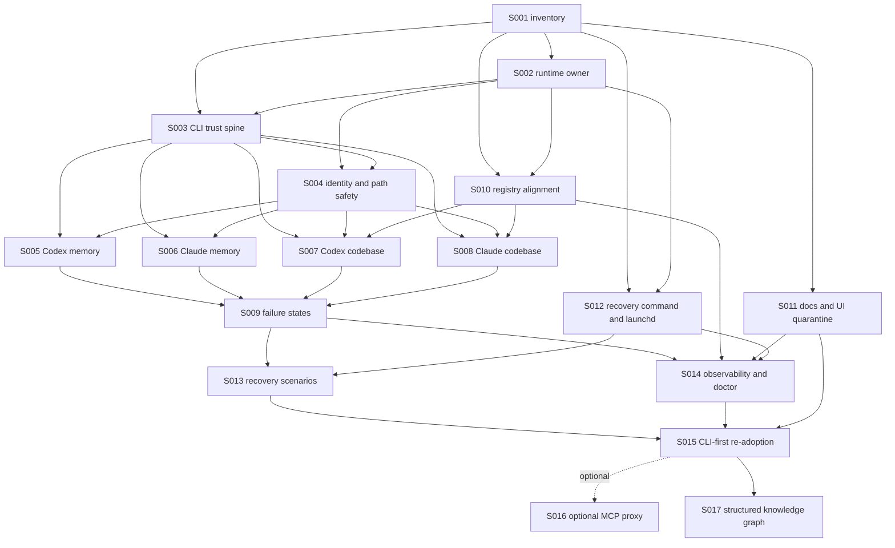

# Coverage: ping-mem Ground-Up Local Trust Rebuild

## Source Artifacts

- PRD: `/Users/umasankr/Projects/ping-mem/docs/prds/2026-04-29-ground-up-local-trust-rebuild.md`
- Architecture: `/Users/umasankr/Projects/ping-mem/docs/architecture/2026-04-29-ground-up-local-trust-rebuild.md`
- Tracking mode: `local-md`
- Package path: `/Users/umasankr/Projects/ping-mem/docs/issues/2026-04-29-ground-up-local-trust-rebuild`
- Latest adversarial review: `ALLOW` from fresh GPT-5.5 subagent on 2026-04-30; findings: none.

## ID Coordination

Local issue ID allocation is `S001` through `S016`.

Evidence gathered before assigning IDs:

| Check | Result | Command |
|---|---:|---|
| Main checkout branch | `main` | `git status --short --branch` |
| Active worktrees | 1, main checkout only | `git worktree list --porcelain` |
| Existing `docs/issues/**` files | none; directory did not exist | `find docs/issues -type f -maxdepth 3 -print` |
| Active `.worktrees/**/docs/issues/**` files | none; `.worktrees` did not exist | `find .worktrees -path '*/docs/issues/*' -type f -print` |
| Existing `S###` IDs in current planning/todo docs | none found | `rg -n '\bS[0-9]{3}\b|^id: S[0-9]{3}' todos docs/plans docs/prds docs/architecture` |

Closure rule for this package: new local issue IDs must remain unique across `docs/issues/**`, active worktrees, and any future synced board data. If a parallel run creates a conflicting `S###`, rerun ID allocation before execution.

## Issue Index

| ID | Title | Type | Blocked by | Proof level | Primary coverage |
|---|---|---|---|---|---|
| S001 | Phase 0 inventory and quarantine ledger | AFK | None | Scaffold plus evidence inventory | FR-1, FR-2, AC-1, AC-12, ADR-011, ADR-013, ADR-017 |
| S002 | REST runtime ownership and direct-mode quarantine | AFK | S001 | Live-runtime plus guardrails | FR-3, FR-4, AC-2, ADR-001, ADR-002, ADR-015 |
| S003 | Unified CLI trust spine | AFK | S001, S002 | Live-runtime scaffold to operational proof harness | FR-5, FR-6, FR-11, FR-12, ADR-003, ADR-004, ADR-006, ADR-008, ADR-009 |
| S004 | Identity and project path safety | AFK | S002, S003 | Live-runtime negative and positive proof | FR-7, FR-8, AC-7, ADR-005, ADR-016 |
| S005 | Codex memory path | AFK | S003, S004 | Operational | FR-5, FR-8, AC-3, AC-8 |
| S006 | Claude Code memory path | AFK | S003, S004 | Operational | FR-5, FR-8, AC-4, AC-8 |
| S007 | Codex codebase grounding path | AFK | S003, S004, S010 | Operational | FR-6, FR-8, AC-5, AC-8, ADR-014, ADR-016 |
| S008 | Claude Code codebase grounding path | AFK | S003, S004, S010 | Operational | FR-6, FR-8, AC-6, AC-8, ADR-014, ADR-016 |
| S009 | Failure-state honesty | AFK | S005, S006, S007, S008 | Live-runtime negative proof | FR-8, FR-11, AC-8, ADR-006, ADR-008, ADR-009 |
| S010 | Runtime project registry alignment | AFK | S001, S002 | Live-runtime cross-surface proof | FR-6, FR-8, FR-10, AC-5, AC-6, AC-10 |
| S011 | Instruction, operator-doc, and static-UI quarantine | AFK | S001 | Evidence inventory plus corrected active surfaces | FR-1, FR-2, FR-11, FR-12, AC-1, AC-10, AC-11, AC-12, ADR-011, ADR-017 |
| S012 | Recovery command and LaunchAgent hygiene | HITL | S001, S002 | Live-runtime readiness plus machine-local approval gate | FR-9, AC-9, ADR-010 |
| S013 | Recovery scenarios | HITL | S009, S012 | Scenario proof | FR-9, AC-9 |
| S014 | Observability and doctor alignment | AFK | S009, S010, S011, S012 | Cross-surface live proof | FR-8, FR-10, FR-11, AC-8, AC-10, ADR-006, ADR-012 |
| S015 | Controlled CLI-first re-adoption | HITL | S001-S014 | Operational rollout proof | FR-2, FR-12, AC-11, AC-12, ADR-003, ADR-008, ADR-011, ADR-013, ADR-017 |
| S016 | Optional later MCP proxy re-adoption | HITL | S015 | Optional operational adapter proof | FR-12, AC-11, AC-12, ADR-004, ADR-009, ADR-012, ADR-013 |
| S017 | Structured Knowledge Graph module | AFK | S015 | Live-runtime graph answer proof | OBJ-1, OBJ-3, OBJ-7, OUT-1, OUT-3, OUT-7, CAP-4, CAP-5, CAP-7 |

Dependency closure rule: `S015` cannot start until `S001` through `S014` are done or have explicit, reviewed blocker dispositions. `S016` is optional and cannot start until the CLI-first re-adoption path has passed.

## Dependency Graph



## Breadth And Depth Discovery Record

Graphify navigation was available and treated as an architecture aid, not proof. `graphify-out/GRAPH_REPORT.md` reported 344 files, 1909 nodes, 3727 edges, and core abstractions including `PingMemSDK`, `EventStore`, `registerUIRoutes()`, `MemoryManager`, `RESTPingMemServer`, and `HybridSearchEngine`. Every graph lead below was checked against actual files or commands.

### Breadth inventory

| Surface class | Discovered evidence | Issue disposition |
|---|---|---|
| REST runtime owner | `src/http/rest-server.ts`, `src/http/server.ts`, `/api/v1/session/*`, `/api/v1/codebase/*`, `/api/v1/tools/:name/invoke`, `/health`, `/ui` | S002, S003, S004, S009, S010, S014 |
| Memory/session state | `src/session/SessionManager.ts`, `src/memory/MemoryManager.ts`, `src/storage/EventStore.ts`, REST session and memory routes | S002, S004, S005, S006, S009 |
| Codebase grounding | `src/ingest/*`, `src/search/*`, `src/mcp/handlers/CodebaseToolModule.ts`, REST codebase routes, `registered-projects.ts` | S004, S007, S008, S010 |
| Agent adapters | `src/cli/*`, `src/client/rest-client.ts`, `src/mcp/proxy-cli.ts`, `src/mcp/PingMemServer.ts`, `package.json` binaries | S002, S003, S004, S015, S016 |
| Failure and proof scripts | `scripts/agent-path-audit.sh`, `scripts/mcp-smoke-test.sh`, `scripts/test-all-capabilities.sh`, `scripts/*ingest*`, `scripts/reconcile-project-inventory.sh` | S001, S002, S009, S011, S012, S014 |
| Status/observability | `src/doctor/*`, `src/observability/*`, `src/http/ui/health.ts`, `src/http/ui/partials/health.ts`, `scripts/soak-monitor.sh` | S009, S012, S014 |
| UI/operator surfaces | `src/http/ui/*`, `src/static/codebase-diagram.html`, `README.md`, `CLAUDE.md`, `AGENT_INSTRUCTIONS.md`, `docs/*` | S010, S011, S014 |
| Machine-local control plane | `/Users/umasankr/.codex/config.toml`, `/Users/umasankr/.claude/*`, `/Users/umasankr/Library/LaunchAgents/com.ping-mem*.plist`, live process table | S001, S011, S012, S015, S016 |
| Machine-local shell startup integration | `/Users/umasankr/.zshrc:101-103` evals `ping-mem` shell-hook when `dist/cli/index.js` exists | S001, S011, S015 |

### Depth probes

| Probe | Evidence | Risk found | Issue |
|---|---|---|---|
| CLI session identity | `src/cli/commands/session.ts` accepts `projectDir`; `agentId` is absent on session start | CLI cannot prove approved agent identity yet | S003, S004 |
| CLI session header | `src/cli/client.ts` does not send `X-Session-ID`; context commands pass `sessionId` inconsistently | Session proof can rely on fallback/body behavior | S003, S004, S005, S006 |
| REST fallback | `src/http/rest-server.ts` falls back to `currentSessionId` when headers/body are missing | Approved proof could hide cross-talk | S004, S009 |
| REST codebase path safety | Some REST codebase paths reject unsafe roots; architecture still requires parity across verify/ingest/search and approved proof | Unsafe `projectDir` must fail before codebase proof counts | S004, S007, S008 |
| Proxy auto-repair | `src/mcp/proxy-cli.ts` calls `tryStartDocker()` on startup path | Read-only proof can mutate runtime | S003, S009, S016 |
| Direct mode | `package.json` exposes `ping-mem-mcp` and `start:mcp` pointing at direct `dist/mcp/cli.js`; direct server warns when `PING_MEM_REST_URL` is missing | Direct DB mode can bypass REST owner | S002, S011, S016 |
| Docs/static UI | `rg` found direct MCP, direct ingest, default credential, and stale recovery guidance across active docs/static UI | Operators can re-enable blocked paths | S001, S011, S014 |
| Live processes | `ps` showed multiple Codex/app-server child processes running `ping-mem/dist/mcp/proxy-cli.js` | Static config absence is not enough to claim quarantine | S001, S015, S016 |
| LaunchAgents | Six active `com.ping-mem*.plist` files exist under `~/Library/LaunchAgents` | Recovery can be masked by stale or write-capable automation | S012, S013 |

## Population And Entrypoint Coverage

Current planning denominator is the architecture seed plus direct repo/machine probes. S001 must turn this into an exact execution-time ledger with one row per discovered item.

| Population or entrypoint set | Discovery rule | Current discovered count | Mapped issue IDs | Closure rule |
|---|---|---:|---|---|
| First-scope agents | PRD decision | 2 | S005, S006, S007, S008, S015 | `2 / 2` agents get operational proof or explicit blocker |
| Memory lifecycle operations | PRD lifecycle list | 6 | S005, S006, S009 | `6 / 6` operations pass for Codex and Claude Code |
| Codebase grounding operations | Architecture contract | 6 | S007, S008, S010 | `6 / 6` operations pass for Codex and Claude Code |
| Failure states | PRD and architecture state lists | 5 minimum PRD states; 10 status states | S009, S014 | all states mapped to output, exit code, and evidence |
| Recovery scenarios | Architecture recovery table | 8 | S012, S013 | `8 / 8` scenarios proven or blocked with actionable reason |
| Status surfaces | PRD UI/workflow inventory | 4 | S009, S010, S014 | health, doctor/status, UI, logs/alerts agree |
| Seed offender rows | Architecture seeded offender ledger | 36 | S001, S002, S003, S004, S010, S011, S012, S014, S015, S016 | `classified_count / discovered_count == 1.0` |
| Active LaunchAgents | `find ~/Library/LaunchAgents -name 'com.ping-mem*.plist'` | 6 | S012, S013, S014 | every label classified with target, credential, write behavior, logs, rollback |
| Existing UI routes | `src/http/ui/layout.ts` and `src/http/ui/routes.ts` | 15 route labels | S010, S011, S014 | every status-relevant route classified active, historical, or out-of-scope |
| Shell startup integration files | `rg -n 'ping-mem|dist/mcp|proxy-cli|codebase_|context_session_start|PING_MEM' ~/.zshrc ~/.zprofile ~/.bashrc ~/.bash_profile` | 1 active hit in `.zshrc` | S001, S011, S015 | every shell startup hook classified, disabled, or explicitly approved before re-adoption |

### Seed offender mapping

| Seed offender or risk | Issue IDs |
|---|---|
| `ping-mem-mcp` binary and `start:mcp` direct MCP mode | S002, S011 |
| `start:proxy` and proxy adapter re-adoption | S003, S016 |
| Live Codex proxy children despite static config | S001, S015, S016 |
| `direct-ingest.ts`, `force-ingest.ts`, `reindex-qdrant.ts`, `migrate-from-memory-keeper.ts` | S002, S011, S012 |
| Installer direct MCP config for Cursor and Claude Code | S011, S015, S016 |
| Existing agent audit used `dist/mcp/cli.js`; S002 replaced its active proof path with REST `/api/v1/tools` and added a regression test | S002, S011, S014 |
| CLI lacks start-time `agentId`, `X-Session-ID`, normalized session behavior, registered project scope | S003, S004, S010 |
| REST/CLI/MCP safe path parity | S004, S007, S008 |
| Installation/integration docs, root instructions, user-level Claude workflow, and static UI teach blocked paths or default credentials | S001, S011, S014, S015 |
| User shell startup evals ping-mem shell hook | S001, S011, S015 |
| UI ingestion/reingest reads host registered-projects file | S010 |
| Default admin credentials in scripts/proof helpers | S003, S009, S011, S014 |
| Proxy auto-starts Docker | S003, S009, S016 |
| Active daemon, doctor, periodic-cognition, periodic-ingest, soak-monitor, system-ready LaunchAgents | S012, S013, S014 |
| Doctor false-green `service.mcp-proxy-stdio` gate | S014 |
| Graph/search returns relationship neighborhoods without complete-answer denominator or provenance | S017 |

## UI And Workflow Experience Coverage

This rebuild is not a UI redesign. UI coverage is limited to truthful operator states and active surfaces that can influence founder or agent behavior.

| Surface | Required states/actions | Data source | Issue IDs | Proof artifact |
|---|---|---|---|---|
| `/health` or successor | healthy, degraded, blocked, dependency down | live runtime probes | S009, S014 | response JSON plus failure examples |
| `ping-mem agent status` / doctor command | pass, fail, blocked, stale, unauthorized, timeout | live runtime, config, logs | S003, S009, S012, S014 | JSON evidence bundle |
| Existing UI status pages | healthy, empty, stale, blocked, error, dependency down | same truth as doctor/status command | S010, S011, S014 | HTML or screenshot evidence |
| Logs/alerts | actionable failure with layer and next action | runtime logs and alert store | S009, S013, S014 | log excerpt evidence |
| CLI proof bundles | read-only by default, explicit repair only | REST runtime and local evidence dir | S003, S005, S006, S007, S008, S009, S015 | evidence bundle directory |
| Graph answer proof bundles | semantic-neighborhood versus complete-graph labels, denominator evidence, provenance, source anchors | REST runtime, Neo4j graph, search stores, source files, event/corpus anchors | S017 | evidence bundle directory |

## Goal Contract Coverage

### Objectives, outcomes, and capabilities

| PRD IDs | Issue IDs |
|---|---|
| OBJ-1, OUT-1, CAP-8 | S001, S003, S005, S006, S011, S015, S016 |
| OBJ-2, OUT-2, CAP-4 | S003, S004, S005, S006, S009 |
| OBJ-3, OUT-3, CAP-5 | S003, S004, S007, S008, S009, S010 |
| OBJ-4, OUT-4, CAP-1 | S001, S002, S003, S010 |
| OBJ-5, OUT-5, CAP-3 | S003, S004, S005, S006, S007, S008, S009 |
| OBJ-6, OUT-6, CAP-6 | S009, S012, S013, S014 |
| OBJ-7, OUT-7, CAP-7 | S009, S010, S011, S014 |
| OBJ-8, OUT-8, CAP-8 | S001, S011, S015, S016 |

### User stories

| User story | Issue IDs |
|---|---|
| US-1 Codex recalls right project context | S003, S004, S005, S015 |
| US-2 Claude Code recalls right project context | S003, S004, S006, S015 |
| US-3 Memory saved by one approved path is searchable from same runtime | S002, S005, S006, S009 |
| US-4 Stale or missing memory data is reported honestly | S005, S006, S009, S014 |
| US-5 Codebase search returns real source anchors | S007, S008 |
| US-6 Repo verification and ingest finish or fail clearly | S007, S008, S009, S010 |
| US-7 Agent/session/project identity is explicit | S004, S005, S006, S007, S008 |
| US-8 Sleep/reboot/restart scenarios do not require babysitting | S012, S013, S014 |
| US-9 Health and UI show broken versus empty states | S009, S010, S014 |
| US-10 Agent re-adoption is gated | S001, S011, S015, S016 |

### Functional requirements

| FR | Issue IDs |
|---|---|
| FR-1 Inventory Codex/Claude entrypoints, runtime, configs, docs, UI, jobs | S001, S011, S012 |
| FR-2 Keep Codex/Claude quarantined until criteria pass | S001, S011, S015, S016 |
| FR-3 Name single owner for writes/sessions/memory/indexes/registry | S002, S010 |
| FR-4 Remove/block/classify direct DB access from active agent paths | S002, S011, S016 |
| FR-5 Test local memory path for Codex and Claude | S003, S005, S006 |
| FR-6 Test local codebase path for Codex and Claude | S003, S007, S008, S010 |
| FR-7 Explicit project/agent/session identity or actionable failure | S004, S005, S006, S007, S008 |
| FR-8 First-class missing/stale/timeout/blocked/unauthorized states | S004, S009, S014 |
| FR-9 Recovery checks for local events and dependencies | S012, S013 |
| FR-10 Health, doctor, UI, logs, alerts agree | S009, S010, S014 |
| FR-11 Final gate read-only by default | S003, S009, S014, S015 |
| FR-12 Re-enable integrations through controlled rollout with backups | S011, S015, S016 |

### Non-functional requirements

| NFR | Issue IDs |
|---|---|
| NFR-1 Reliability | S005, S006, S009, S012, S013 |
| NFR-2 Determinism | S003, S004, S005, S006, S007, S008, S009, S013 |
| NFR-3 Observability | S004, S009, S014 |
| NFR-4 Data safety | S002, S004, S010 |
| NFR-5 Privacy/security | S003, S011, S012, S015, S016 |
| NFR-6 Performance/timeouts | S003, S007, S008, S009, S014 |
| NFR-7 Operability | S009, S012, S013, S014 |
| NFR-8 Rollback safety | S011, S015, S016 |

### Acceptance criteria

| AC | Issue IDs |
|---|---|
| AC-1 Phase 0 inventory and classification | S001, S011, S012 |
| AC-2 Architecture names one runtime owner | S002, S010 |
| AC-3 Codex memory lifecycle proof passes | S005 |
| AC-4 Claude Code memory lifecycle proof passes | S006 |
| AC-5 Codex codebase grounding proof passes | S007, S010 |
| AC-6 Claude Code codebase grounding proof passes | S008, S010 |
| AC-7 Every approved path proves explicit identity | S004, S005, S006, S007, S008 |
| AC-8 Failure-state tests fail loudly | S009, S014 |
| AC-9 Recovery tests recover or report actionable blockers | S012, S013 |
| AC-10 Health, doctor, UI, logs, alerts align | S010, S014 |
| AC-11 Re-adoption restored only after AC-1 through AC-10 pass | S015, S016 |
| AC-12 Final completion claim limited to proven local paths | S001, S015, S016 |

### Architecture decisions

| ADR | Issue IDs |
|---|---|
| ADR-001 REST/server is only approved live owner | S002, S010 |
| ADR-002 Direct MCP DB mode is offline/dev only | S002, S011, S016 |
| ADR-003 First re-adoption uses unified CLI plus skill over REST | S003, S015 |
| ADR-004 MCP proxy optional second stage | S003, S016 |
| ADR-005 Approved stateful paths require identity | S004, S005, S006, S007, S008 |
| ADR-006 Acceptance gates read-only by default | S003, S009, S014, S015 |
| ADR-007 Adversarial review runs on local issue package before implementation | Fresh GPT-5.5 review returned `ALLOW` on 2026-04-30 with no findings |
| ADR-008 Machine-local auth avoids committed plaintext credentials | S003, S011, S012, S015, S016 |
| ADR-009 Proxy startup must not auto-start Docker | S003, S009, S016 |
| ADR-010 Recovery proof requires repo-owned status command and LaunchAgent reconciliation | S012, S013 |
| ADR-011 Root/user-level agent instructions are product control plane | S001, S011, S015 |
| ADR-012 Doctor/status cannot call direct MCP presence proxy readiness | S014 |
| ADR-013 Static config inventory is not enough; live process inventory must be clean | S001, S015, S016 |
| ADR-014 Codebase grounding includes verify, ingest, search, timeline, registered inventory, anchors | S007, S008, S010 |
| ADR-015 Write-capable maintenance scripts are offline-only or blocked | S002, S011, S012 |
| ADR-016 REST codebase routes must enforce safe project paths | S004, S007, S008 |
| ADR-017 Active docs/runbooks/static UI are product control plane | S001, S011, S014 |

## Horizontal Layer Map

| Issue | Config/process | REST/API | CLI/adapter | Data/state | UI/docs | Tests/proof | Ops/recovery |
|---|---|---|---|---|---|---|---|
| S001 | yes | yes | yes | yes | yes | yes | yes |
| S002 | yes | yes | yes | yes | yes | yes | yes |
| S003 | yes | yes | yes | no direct writes | skill docs | yes | no auto-repair proof |
| S004 | no | yes | yes | session/project safety | no | yes | no |
| S005 | Codex skill | yes | yes | memory lifecycle | no | yes | no |
| S006 | Claude skill | yes | yes | memory lifecycle | no | yes | no |
| S007 | Codex skill | yes | yes | indexes/registry | no | yes | no |
| S008 | Claude skill | yes | yes | indexes/registry | no | yes | no |
| S009 | auth/config | yes | yes | failure states | status text | yes | dependency-down |
| S010 | runtime registry | yes | yes | registry | UI ingestion | yes | no |
| S011 | agent configs | no | install/audit docs | no | docs/static UI | yes | no |
| S012 | LaunchAgents | status API | status command | heartbeat/logs | runbook | yes | yes |
| S013 | machine events | health/status | status command | stores/services | no | yes | yes |
| S014 | configs | health/status | doctor | logs/alerts | UI health | yes | yes |
| S015 | Codex/Claude configs | no | CLI skill | session files | skill docs | yes | rollback |
| S016 | MCP configs | tool invoke | proxy | session identity | docs | yes | rollback |

## Readiness Gate

First ready AFK slice: `S001-phase-0-inventory-and-quarantine-ledger.md`.

HITL / approval slices:

- `S012` because active LaunchAgent mutation, credential relocation, or unload/reload actions require explicit approval.
- `S013` because Mac sleep/reboot and dependency restart scenarios may disrupt the local machine and must be scheduled/approved.
- `S015` because controlled re-adoption writes Codex/Claude config/skill surfaces.
- `S016` because optional MCP proxy re-adoption is explicitly later and optional.

No `/to-execute` run may begin until latest adversarial review for this package is `ALLOW`.

## Exact Next Execution Prompt After ALLOW

```text
We are in /Users/umasankr/Projects/ping-mem.

Ignore stale stop hooks for GitHub issue #90. Active work is the ping-mem ground-up local trust rebuild.

Use /Users/umasankr/.codex/skills/to-execute/SKILL.md.
Do not use ping-mem/codebase_verify/codebase_ingest/codebase_search for grounding.
Do not create GitHub child issues.
Do not start any issue other than S001.

Execute one approved local issue:
/Users/umasankr/Projects/ping-mem/docs/issues/2026-04-29-ground-up-local-trust-rebuild/S001-phase-0-inventory-and-quarantine-ledger.md

Source contract:
- PRD: /Users/umasankr/Projects/ping-mem/docs/prds/2026-04-29-ground-up-local-trust-rebuild.md
- Architecture: /Users/umasankr/Projects/ping-mem/docs/architecture/2026-04-29-ground-up-local-trust-rebuild.md
- Coverage ledger: /Users/umasankr/Projects/ping-mem/docs/issues/2026-04-29-ground-up-local-trust-rebuild/COVERAGE.md

Stay read-only except for creating S001 evidence artifacts and updating the S001 issue file/status/evidence. Do not change product code, agent configs, LaunchAgents, GitHub issues, or re-adopt ping-mem.
```
