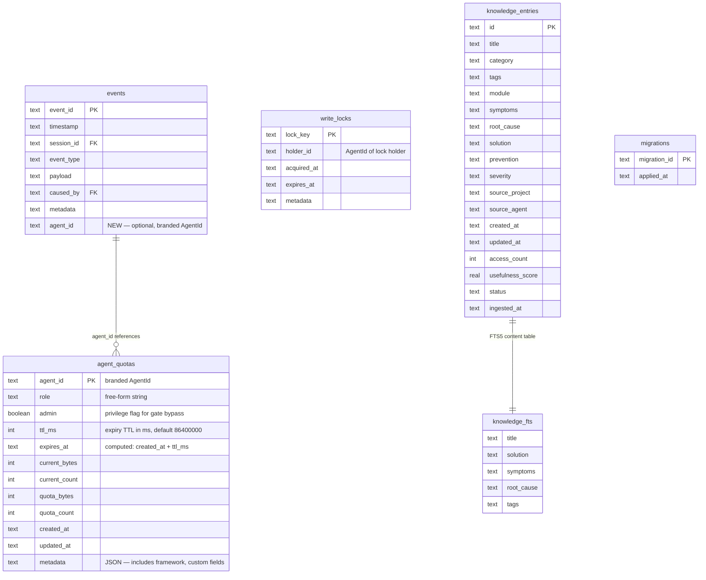

# Multi-Agent Memory Orchestration — ping-mem v2.0.0

## Overview

Transform ping-mem from a single-agent memory layer into a **framework-agnostic multi-agent memory system** serving concurrent agents from any source — Claude Code, Codex, Cursor, Cline, Antigravity, Understory, custom MCP clients, or any REST-capable agent framework — with identity-scoped memory, write safety, intelligent compression, and cross-project knowledge sharing.

**Product Purpose**: ping-mem is the Universal Memory Layer for AI Agents. This enhancement solves the multi-agent coordination problem: how do agents from diverse frameworks share memory safely, efficiently, and intelligently — without ping-mem caring where they come from?

**Core Value (3 things that matter)**:
1. **Agent identity** — who wrote what, with scope-based isolation
2. **Write safety** — no data corruption under concurrent writes
3. **Token efficiency** — semantic compression reduces context window usage by 80%+

**Scope**: 3 phases, 6 new source files, 5 new MCP tools, 7 new REST endpoints, 3 SQL migrations.

---

## Problem Statement

### The Single-Agent Ceiling

ping-mem v1.5.0 treats all memory as belonging to a session, not an agent. When multiple agents from different frameworks share a ping-mem instance:

1. **No isolation**: Agent-A's working memory is visible to Agent-B — cross-contamination across frameworks
2. **No permissions**: Any agent can overwrite any other agent's decisions — no role-based access
3. **No quotas**: A runaway agent can exhaust storage for all other agents
4. **Write corruption**: Two agents saving to the same key simultaneously corrupt in-memory Maps (documented race condition in CLAUDE.md)
5. **Context bloat**: 100+ verbose memories per session consume 5,000+ tokens of context window — agents hit limits faster
6. **No coordination**: Agents must poll for updates — no push notifications when an agent completes work
7. **No knowledge reuse**: Engineering knowledge stays in session-local memory — other projects and frameworks cannot benefit

### Token Efficiency Gap

The research synthesis (`docs/research/05-synthesis-pros-cons.md`) establishes that graph-structured retrieval achieves 90%+ token reduction over verbatim context storage. ping-mem's current `RelevanceEngine.consolidate()` uses string truncation (`src/memory/RelevanceEngine.ts:526-536`), not semantic compression. Truncation destroys causal chains and decision rationale.

### Codebase Sync State

The deterministic code ingestion pipeline (Merkle tree-verified, path-independent projectId) is ping-mem's unique differentiator. This plan does NOT modify the ingestion pipeline but DOES ensure new features degrade gracefully on VPS (no `/projects` mount).

---

## Proposed Solution

### Architecture: Layered Enhancement on Event-Sourced Foundation

```
┌─────────────────────────────────────────────────────────────────┐
│                     Agent Interaction Layer                       │
│  MCP Tools (41 total)  │  REST API (7 new endpoints)  │  CLI    │
├─────────────────────────────────────────────────────────────────┤
│                     Safety Layer (NEW)                            │
│  AgentIdentity  │  WriteLockManager  │  ScopeEnforcer           │
├─────────────────────────────────────────────────────────────────┤
│                     Intelligence Layer (NEW)                     │
│  SemanticCompressor  │  KnowledgeStore  │  MemoryPubSub         │
├─────────────────────────────────────────────────────────────────┤
│                     Existing Foundation (v1.5.0)                 │
│  EventStore  │  MemoryManager  │  SessionManager  │  Search    │
│  GraphManager  │  HybridSearch  │  RelevanceEngine  │  Ingest  │
└─────────────────────────────────────────────────────────────────┘
```

Every new layer is **optional and additive** — the existing foundation continues to work unchanged for single-agent use.

---

## AI Experience (Agent-Facing UX)

### Design Principle: Zero-Friction Agent Onboarding

An agent's interaction with ping-mem requires **zero additional setup** for basic use and **one registration call** for multi-agent features. The current single-agent flow remains unchanged.

### Agent Interaction Flows

**Flow A: Existing Agent (Backward Compatible)**
```
context_session_start(name: "my-session")     # Unchanged
context_save(key: "task", value: "build API")  # Unchanged — no agentId = public scope
context_get(key: "task")                        # Returns all public memories
```

**Flow B: Multi-Agent with Identity (any framework)**
```
# Claude Code agent registers
agent_register(agentId: "claude-code-1", role: "developer",
               metadata: { framework: "claude-code" })

# Cursor agent registers with same role
agent_register(agentId: "cursor-1", role: "developer",
               metadata: { framework: "cursor" })

# Cline agent registers with a different role
agent_register(agentId: "cline-reviewer-1", role: "reviewer",
               metadata: { framework: "cline" })

context_session_start(name: "dev-session", agentId: "claude-code-1")
context_save(key: "progress", value: "...", agentScope: "role")
  → Visible to cursor-1 (same "developer" role) but NOT to cline-reviewer-1 ("reviewer" role)
```

**Flow C: Real-Time Coordination (cross-framework)**
```
# A reviewer agent subscribes to task completions via SSE
GET /api/v1/events/stream?categories=task_complete&roles=developer
  → SSE stream delivers MemoryEvents in real-time

# A developer agent saves a result — all subscribers get notified
context_save(key: "task-42", value: "...", category: "task_complete",
             metadata: { command: "bun test", exitCode: 0, output: "1169 pass" })
```

**Flow D: Token-Efficient Context Retrieval**
```
# Session has 150 verbose memories (7,500 tokens of context)
memory_compress(strategy: "extract-facts", targetRatio: 0.2)
  → SemanticCompressor extracts 30 durable facts (1,500 tokens)
  → Facts stored as high-priority memories with category: "digest"
  → Original memories archived, not deleted
  → Agent's next context_get returns compressed facts, saving 80% tokens
```

**Flow E: Cross-Project Knowledge**
```
# Any agent from any framework queries the shared knowledge store
knowledge_search(query: "authentication race condition", limit: 5,
                 crossProject: true)
  → Returns entries from ping-mem, sn-assist, ro-new, openclaw
  → Each result has score, highlights, sourceProject
```

### Agent Lifecycle: Ephemeral by Default

All agents are **ephemeral**. Registration exists solely to process concurrent requests safely — not to build a permanent roster.

- Registration auto-expires after configurable TTL (default: 24h)
- Expired registrations are cleaned up lazily on next lock acquisition (2 SQL DELETEs)
- Memories created by expired agents are NOT deleted — they remain with `agent_id` as provenance
- No background timer, no GC process — cleanup happens when it matters

```typescript
// Ephemeral agent (default) — expires in 24 hours
agent_register(agentId: "claude-code-abc123", role: "developer")

// Ephemeral with custom TTL — expires in 1 hour
agent_register(agentId: "cursor-review-1", role: "reviewer", ttlMs: 3600000)
```

### Auto-Populate agentId from Session

When `context_session_start` is called with `agentId`, store it in the session metadata (not mutable global state). All subsequent `context_save` calls within that session auto-populate `agentId` from session metadata unless explicitly overridden.

```typescript
// In ContextToolModule.handleContextSave():
const session = this.state.memoryManagers.get(this.state.currentSessionId);
const effectiveAgentId = args.agentId ?? session?.agentId ?? undefined;
```

### Agent UX Quality Requirements

| Requirement | Metric | Rationale |
|-------------|--------|-----------|
| Zero setup for basic use | 0 new calls for existing agents | Backward compatibility is non-negotiable |
| Single-call registration | 1 MCP call to enable all multi-agent features | Minimize agent cognitive overhead |
| Auto-populated agentId | Session-level, not per-call | Prevents orphaned public memories from forgotten agentId |
| Clear error messages | Error code + human-readable message + fix suggestion | Agents can self-correct without human intervention |
| Sub-5ms overhead | Lock acquisition < 5ms on uncontested writes | Agents should not perceive latency from safety features |

---

## User Experience (Human-Facing UX)

### Human Workflow Impact

| Before (v1.5.0) | After (v2.0.0) | Impact |
|------------------|----------------|--------|
| Check each agent's memory manually | `GET /api/v1/agents/quotas` shows all usage | Monitoring: API-driven |
| Debug memory conflicts by reading event logs | Write locks prevent conflicts; audit trail shows contention | Debugging: proactive prevention |
| Context window overflows require manual pruning | Semantic compression automates 80% reduction | Token efficiency: automated |
| Knowledge stays siloed in sessions | Knowledge search spans projects | Knowledge reuse: from 0 to universal |

Admin UI dashboards deferred to v2.1 — ship the features, get real usage, then build the dashboard users actually need.

---

## Error Taxonomy

Six new failure modes require machine-readable error codes so agents can self-correct:

```typescript
// src/types/agent-errors.ts (new)

export class QuotaExhaustedError extends PingMemError {
  // code: "QUOTA_EXHAUSTED", fix: "Delete old memories or request quota increase"
}

export class WriteLockConflictError extends PingMemError {
  // code: "WRITE_LOCK_CONFLICT", fix: "Retry after lock expiry or use a different key"
}

export class ScopeViolationError extends PingMemError {
  // code: "SCOPE_VIOLATION", fix: "Use a memory with compatible scope"
}

export class SchemaValidationError extends PingMemError {
  // code: "SCHEMA_VALIDATION_FAILED", fix: "Check required fields for this category"
}

export class EvidenceGateRejectionError extends PingMemError {
  // code: "EVIDENCE_GATE_REJECTED", fix: "Add required metadata fields"
}

export class AgentNotRegisteredError extends PingMemError {
  // code: "AGENT_NOT_REGISTERED", fix: "Call agent_register first"
}
```

Each error includes `{ code, message, fix, context }` for programmatic handling.

---

## Technical Approach

### Type Design Decisions

**Branded `AgentId`** — security boundary type, prevents mixing with SessionId/MemoryId:
```typescript
declare const AgentIdBrand: unique symbol;
export type AgentId = string & { readonly [AgentIdBrand]: typeof AgentIdBrand };
```

**Free-form `AgentRole`** — plain `string`, not an enum. Any framework defines its own roles.

**Open `MemoryCategory`** — uses the `(string & {})` trick to preserve autocomplete for built-in categories while accepting arbitrary strings:
```typescript
export type BuiltInCategory = "task" | "decision" | "progress" | "note"
  | "error" | "warning" | "fact" | "observation" | "knowledge_entry" | "digest";
export type MemoryCategory = BuiltInCategory | (string & {});
```

**Closed `AgentMemoryScope`** — security boundary, must be a closed union:
```typescript
/**
 * - "private": Visible only to the owning agent
 * - "role": Visible to all agents sharing the same role
 * - "shared": Visible to all registered agents
 * - "public": Visible to all (including unregistered/legacy agents)
 */
export type AgentMemoryScope = "private" | "role" | "shared" | "public";
```

### Implementation Phases

#### Phase 1: Agent Identity + Write Safety + Data Quality (Foundation)

**Goal**: Enable multi-agent operation with isolation, safety, and structured validation. Everything else builds on this.

**Includes**: Original Phase 1 + Phase 2 (schemas/gates folded in as config constants, not infrastructure).

| # | Task | Files | Effort | Dependencies |
|---|------|-------|--------|-------------|
| 1.1 | Add branded `AgentId`, `AgentRole`, `AgentMemoryScope`, `AgentIdentity`, `AgentQuotaUsage` types. Add `BuiltInCategory` + open `MemoryCategory`. | `src/types/index.ts`, `src/types/agent-errors.ts` (new) | 0.5d | None |
| 1.2 | Add 6 error classes (`QuotaExhausted`, `WriteLockConflict`, `ScopeViolation`, `SchemaValidation`, `EvidenceGateRejection`, `AgentNotRegistered`) | `src/types/agent-errors.ts` | 0.5d | 1.1 |
| 1.3 | Extend `Memory` interface with `agentId?`, `agentScope?`; extend `Event` with `agent_id?` | `src/types/index.ts`, `src/storage/EventStore.ts` | 0.5d | 1.1 |
| 1.4 | Add `migrations` table for idempotent DDL tracking | `src/storage/EventStore.ts` | 0.5d | None |
| 1.5 | Schema migration: `events.agent_id`, `agent_quotas` table, `write_locks` table | `src/storage/EventStore.ts` | 1d | 1.4 |
| 1.6 | Implement `WriteLockManager` with atomic `INSERT ... ON CONFLICT`, lazy cleanup of expired agents/locks on acquisition, 50ms fast-fail timeout (not 5s busy timeout) | `src/storage/WriteLockManager.ts` (new) | 1.5d | 1.5 |
| 1.7 | Wire agent identity into `MemoryManager`: scope enforcement, quota checks. Lock acquired BEFORE in-memory cache read (not just before SQLite write) | `src/memory/MemoryManager.ts` | 1.5d | 1.6 |
| 1.8 | Wire agent identity into `SessionManager`: accept `agentId`, store in session metadata (per-session, not global mutable state) | `src/session/SessionManager.ts` | 0.5d | 1.3 |
| 1.9 | Add `AgentToolModule`: `agent_register`, `agent_quota_status`, `agent_deregister`. Zod validation on MCP tool args. | `src/mcp/handlers/AgentToolModule.ts` (new) | 1d | 1.5, 1.7 |
| 1.10 | Update REST: `X-Agent-ID` header, 3 agent endpoints | `src/http/rest-server.ts` | 0.5d | 1.9 |
| 1.11 | Auto-populate `agentId` from session metadata in `ContextToolModule` | `src/mcp/handlers/ContextToolModule.ts` | 0.5d | 1.8 |
| 1.12 | Add Zod memory schemas as constants in `api-schemas.ts` (task_complete, review_finding, decision, knowledge_entry, digest). Validate in `MemoryManager.save()` when `strictSchema: true` | `src/validation/api-schemas.ts` | 0.5d | 1.3 |
| 1.13 | Add evidence gates as TypeScript config constant. Check in `MemoryManager.save()`. `admin: true` flag on registration allows skip. Surface warnings in MCP response `warnings[]` field | `src/validation/evidence-gates.ts` (new, ~30 LOC config + ~20 LOC checker) | 0.5d | 1.9 |
| 1.14 | Write tests: scope enforcement (24 permutations: 4 scopes x 3 roles x read/write), quota exhaustion, concurrent write safety (3-agent integration test), backward compat, schema validation, evidence gates | `src/*/__tests__/` | 3.5d | All above |
| | **Phase 1 Total** | | **13d** | |

**Parallelism**: Tasks 1.1-1.2 (types/errors), 1.4 (migrations) can run in parallel. Tasks 1.12-1.13 (schemas/gates) can run in parallel with 1.8-1.10.

**Quality Gate**: `bun run typecheck && bun test` — zero regressions. Existing 1169 tests pass unchanged. 3-agent concurrent integration test passes.

**Architectural Constraint**: Single-writer deployment. Add startup `flock` check to prevent accidental multi-container deployment against same SQLite file.

#### Phase 2: Knowledge + Pub/Sub (Integration)

**Goal**: Cross-project knowledge sharing and real-time agent coordination via SSE.

| # | Task | Files | Effort | Dependencies |
|---|------|-------|--------|-------------|
| 2.1 | Implement `KnowledgeStore` with FTS5 (index: title, solution, symptoms, root_cause, tags), UPSERT on ingest, stats queries. Include Neo4j entity mapping as private method (not separate file) | `src/knowledge/KnowledgeStore.ts` (new) | 2d | Phase 1 |
| 2.2 | Add FTS5 virtual table + `knowledge_entries` DDL in migration | `src/storage/EventStore.ts` | 0.25d | 1.4 |
| 2.3 | Add knowledge REST endpoints: `POST /search` (with `crossProject` param), `POST /ingest` | `src/http/rest-server.ts` | 0.5d | 2.1 |
| 2.4 | Add knowledge MCP tools (`knowledge_search`, `knowledge_ingest`). Zod validation on tool args | `src/mcp/handlers/KnowledgeToolModule.ts` (new) | 0.5d | 2.1 |
| 2.5 | Unify write path: `context_save(category="knowledge_entry")` also writes to `KnowledgeStore` via transactional dual-write (same SQLite transaction, rollback on either failure) | `src/mcp/handlers/ContextToolModule.ts` | 0.5d | 2.1 |
| 2.6 | Implement `MemoryPubSub` with scope-aware publishing (private memories filtered at publisher). In-process EventEmitter + SSE delivery only (no webhooks — deferred to v2.1) | `src/pubsub/MemoryPubSub.ts` (new) | 1d | Phase 1 |
| 2.7 | Add SSE stream endpoint with heartbeat (30s), connection limit (max 50), `since` timestamp filter on `context_search` | `src/http/rest-server.ts` | 0.5d | 2.6 |
| 2.8 | Add `memory_subscribe`/`memory_unsubscribe` as tools in `MemoryToolModule` (existing file, currently 93 LOC with 2 tools — room for 2 more) | `src/mcp/handlers/MemoryToolModule.ts` | 0.5d | 2.6 |
| 2.9 | Wire pub/sub into `MemoryManager` (publish on save/update/delete) | `src/memory/MemoryManager.ts` | 0.5d | 2.6 |
| 2.10 | Write tests: knowledge CRUD, FTS5 search, cross-project, pub/sub delivery, scope filtering, SSE integration, private memory leak prevention | `src/*/__tests__/` | 2.5d | All above |
| | **Phase 2 Total** | | **8.75d** | |

**Parallelism**: Knowledge (2.1-2.5) and PubSub (2.6-2.9) are independent — can run as two parallel workstreams.

#### Phase 3: Compression + Deployment (Intelligence)

**Goal**: Intelligent memory management with proper design, and production deployment.

| # | Task | Files | Effort | Dependencies |
|---|------|-------|--------|-------------|
| 3.1 | Implement `SemanticCompressor` — detailed design: LLM prompt engineering for fact extraction, observer/reflector pattern, quality benchmarks (semantic accuracy, not just token ratio), cost modeling per compression call | `src/memory/SemanticCompressor.ts` (new) | 3d | Phase 1 |
| 3.2 | Hierarchical batching: split >8K token sessions into coherent chunks (by channel/category), cross-batch fact dedup by semantic similarity | `src/memory/SemanticCompressor.ts` | 1d | 3.1 |
| 3.3 | Integrate with `RelevanceEngine.consolidate()` — use compressor when available, fallback to truncation. Exempt `digest` category from evidence gates. Exclude in-progress sessions (no activity in 30min) | `src/memory/RelevanceEngine.ts`, `src/validation/evidence-gates.ts` | 1d | 3.1 |
| 3.4 | Add `memory_compress` MCP tool with strategy selection, cost estimate in response | `src/mcp/handlers/MemoryToolModule.ts` | 0.5d | 3.1 |
| 3.5 | Update Docker Compose files (local + VPS) with new env vars | `docker-compose.yml`, `docker-compose.prod.yml` | 0.5d | None |
| 3.6 | Migration script (idempotent, uses migrations table) | `scripts/migrate-v2.sh` (new) | 0.5d | 1.4 |
| 3.7 | Deploy and verify on VPS | - | 1d | All |
| 3.8 | Write tests: compression ratio, fact extraction quality (semantic accuracy metric), observer/reflector, graceful degradation when no LLM API key | `src/*/__tests__/` | 1.5d | 3.1-3.3 |
| 3.9 | Integration test: 10-agent concurrent simulation (expanded from Phase 1's 3-agent test) with knowledge search, pub/sub, compression | `src/__tests__/integration/` | 1.5d | All |
| 3.10 | Update CLAUDE.md (MCP tools table, env vars, key directories), README.md (agent identity, knowledge API examples) | `CLAUDE.md`, `README.md` | 0.5d | All |
| | **Phase 3 Total** | | **11d** | |

**Parallelism**: Compression (3.1-3.4) can start immediately. Docker/deploy (3.5-3.7) can run in parallel with testing (3.8-3.9).

### Total Estimate: 23 developer-days (across 3 phases)

(Down from 37d after review simplifications — 38% reduction. Core value preserved.)

---

## Execution Plan: Dependency Graph and Parallelism

### Phase 1 Execution (13d wall-clock → ~8d with parallelism)

```
Stream A (Types + DB):     1.1 → 1.3 → 1.5 → 1.6 → 1.7
Stream B (Migrations):     1.4 (parallel with 1.1)
Stream C (Errors):         1.2 (parallel with 1.1, depends on 1.1 types)
Stream D (Validation):     1.12 + 1.13 (parallel, after 1.3)
Stream E (MCP/REST):       1.9 → 1.10 → 1.11 (after 1.7)
Stream F (Tests):          1.14 (after all above, sequential)
```

### Phase 2 Execution (8.75d wall-clock → ~5d with parallelism)

```
Stream A (Knowledge):      2.1 → 2.2 → 2.3 → 2.4 → 2.5
Stream B (PubSub):         2.6 → 2.7 → 2.8 → 2.9
                           (A and B fully parallel)
Stream C (Tests):          2.10 (after A + B merge)
```

### Phase 3 Execution (11d wall-clock → ~7d with parallelism)

```
Stream A (Compressor):     3.1 → 3.2 → 3.3 → 3.4
Stream B (Deploy):         3.5 + 3.6 (parallel with Stream A)
Stream C (Tests):          3.8 → 3.9 (after A, parallel with 3.7)
Stream D (Docs):           3.10 (parallel with C)
Final:                     3.7 (deploy, after all streams)
```

**Estimated wall-clock with parallelism: ~20 days**

---

## Alternative Approaches Considered

### 1. Process-Level Isolation (Separate MemoryManager per Agent)
**Rejected**: Breaks cross-agent search and knowledge sharing. Duplicates memory.

### 2. Redis-Based Pub/Sub
**Rejected**: Adds infrastructure dependency. In-process EventEmitter + SSE covers all use cases.

### 3. PostgreSQL for Write Safety
**Rejected**: SQLite WAL + advisory locks sufficient for 10-50 agents, ~100 writes/min.

### 4. Dynamic Schema/Gate Registration via REST API
**Rejected (by review)**: YAGNI. Schemas are TypeScript code (Zod). Evidence gates are a config constant. If a framework needs custom schemas, they change code and redeploy — same as every other validation rule in the codebase. Dynamic registration deferred to v2.1 if demand materializes.

### 5. Separate AgentGarbageCollector with Background Timer
**Rejected (by review)**: Lazy cleanup on lock acquisition (2 SQL DELETEs) eliminates the need for a background process. Agent registrations are tiny rows — even 10,000 use kilobytes.

### 6. Webhook Delivery for Pub/Sub
**Deferred to v2.1**: SSE covers the push use case for MCP and REST clients. No webhook consumer exists today.

### 7. Four Admin UI Dashboards
**Deferred to v2.1**: Ship features first, build dashboards when real users need monitoring.

---

## Acceptance Criteria

### Functional Requirements

- [ ] Agent registration with role and quotas works via MCP and REST
- [ ] Branded `AgentId` type prevents compile-time confusion with SessionId/MemoryId
- [ ] Memory scope enforcement: private/role/shared/public reads and writes correct
- [ ] Quota exhaustion returns `QuotaExhaustedError` with code, message, and fix suggestion
- [ ] Concurrent writes to same key: one succeeds, other gets `WriteLockConflictError`
- [ ] Concurrent writes to different keys: both succeed (no false contention)
- [ ] Schema validation works with `strictSchema: true` (Zod schemas in code)
- [ ] Evidence gates check metadata fields, surface `warnings[]` in MCP response
- [ ] SSE pub/sub delivers real-time events to subscribers
- [ ] Private memories are NOT leaked through pub/sub events
- [ ] Semantic compression achieves 80%+ token reduction on 100-memory sessions
- [ ] Compression quality: extracted facts preserve semantic accuracy (not just token count)
- [ ] Knowledge ingestion with dedup, FTS5 search (title + solution + symptoms + root_cause + tags), cross-project search
- [ ] All existing MCP tools continue to work without modification
- [ ] All existing REST endpoints continue to work without modification
- [ ] Migration script is idempotent on both local and VPS databases

### Non-Functional Requirements

- [ ] Write lock overhead < 5ms on uncontested single-agent writes
- [ ] Lock acquisition fast-fail at 50ms (not 5s busy timeout)
- [ ] 3-agent concurrent integration test in Phase 1, expanded to 10-agent in Phase 3
- [ ] SSE connection limit: max 50 concurrent, graceful rejection beyond
- [ ] Compression costs: estimated per-call, opt-in via `PING_MEM_COMPRESSION_ENABLED=false` default
- [ ] All features degrade gracefully when optional services unavailable
- [ ] Single-writer deployment enforced via startup `flock` check

### Quality Gates

- [ ] `bun run typecheck` — 0 errors
- [ ] `bun test` — 100% pass, zero regressions on existing 1169 tests
- [ ] `bun run build` — no errors
- [ ] No `any` types in new code
- [ ] No TODO/FIXME/stub/placeholder in committed code
- [ ] Documentation updated (CLAUDE.md, README.md)
- [ ] Zod validation on all new MCP tool handler arguments (not `as` casts)

---

## Success Metrics

| Metric | Target | Measurement |
|--------|--------|-------------|
| Agent isolation correctness | 100% — no cross-agent leaks | 24-permutation scope test suite |
| Write safety | 0 corruption under concurrent writes | 3-agent (Phase 1) + 10-agent (Phase 3) stress tests |
| Token reduction | 80%+ via semantic compression | Pre/post context token counts on real sessions |
| Compression quality | Extracted facts preserve >90% semantic accuracy | Manual review of 20 fact extractions |
| Knowledge reuse | Cross-project search returns relevant results | Precision@5 > 0.7 on test knowledge base |
| Latency overhead | < 5ms per write (lock acquisition) | Benchmark single-agent write path before/after |
| Backward compatibility | 0 regressions | All existing tests pass unchanged |

---

## Risk Analysis and Mitigation

### Critical Risks

| Risk | Likelihood | Impact | Mitigation |
|------|-----------|--------|------------|
| Private memory leak via pub/sub | High (spec gap) | Critical — agent secrets exposed | Publisher-side scope filtering. Test: subscribe as outsider, verify private memories not received |
| Migration failure on production data | Medium | Critical — data loss | Idempotent DDL with `migrations` table. Backup before migrate. Test on VPS staging first |
| SQLite concurrent writers across Docker containers | Medium | High — corruption | Single-writer deployment. Startup `flock` check prevents multi-container on same DB file |

### Important Risks

| Risk | Likelihood | Impact | Mitigation |
|------|-----------|--------|------------|
| Write lock contention under 10+ agents | Medium | High — deadlocks | Per-key granularity. 30s timeout with auto-expiry. 50ms fast-fail. No multi-key lock operations (lock one key at a time, retry on conflict) |
| In-memory cache race condition | High (existing bug) | High — data loss | Lock acquired BEFORE cache read, not just before SQLite write. Alternatively, remove in-memory cache and read from SQLite (WAL mode = fast reads) |
| LLM compression costs at scale | Medium | Medium — bills | Opt-in via env var (default off). Cost estimate in response. Cache compressed results |
| `currentAgentId` race on concurrent MCP requests | Medium | High — wrong agent identity | Store agentId per-session in session metadata, not on mutable global `SessionState` |

### Medium Risks

| Risk | Likelihood | Impact | Mitigation |
|------|-----------|--------|------------|
| SSE connection exhaustion on VPS | Low | Medium | Max 50 concurrent. Graceful rejection beyond |
| Knowledge dual-write inconsistency | Medium | Medium | Same SQLite transaction for EventStore + KnowledgeStore. Rollback on either failure |
| Unbounded agent registration buildup | Medium | Low | Lazy cleanup on lock acquisition. Ephemeral-by-default with TTL |

---

## Token Efficiency and Context Engineering

**Three mechanisms for token reduction:**

1. **Semantic Compression** (Phase 3): LLM extracts durable facts from verbose memories. 100 memories (~5,000 tokens) → 30 facts (~1,500 tokens). 3x longer context windows.

2. **Agent Scope Filtering** (Phase 1): Scope enforcement filters irrelevant memories. Developer-role agents see developer-scoped + shared memories only.

3. **Structured Schemas** (Phase 1): JSON-structured `task_complete` uses ~50 tokens vs ~200 tokens for prose equivalent.

**Combined impact**: ~76% token reduction for multi-agent sessions (5,000 → 1,200 tokens).

**Context graph**: Graph search stub (`HybridSearchEngine.graphSearch()` returns `[]`) is addressed in the existing memory enhancement plan (`docs/plans/2026-02-20-memory-enhancement-design.md`). This plan's Knowledge API feeds knowledge entries into the graph as `EntityType.FACT` nodes.

---

## New Files Summary

| File | Purpose | Phase |
|------|---------|-------|
| `src/types/agent-errors.ts` | 6 error classes with codes and fix suggestions | 1 |
| `src/storage/WriteLockManager.ts` | SQLite advisory locks with lazy GC | 1 |
| `src/mcp/handlers/AgentToolModule.ts` | Agent register/deregister/quota MCP tools | 1 |
| `src/validation/evidence-gates.ts` | Evidence gate config constant + checker (~50 LOC) | 1 |
| `src/knowledge/KnowledgeStore.ts` | Knowledge CRUD + FTS5 + Neo4j mapping (private method) | 2 |
| `src/pubsub/MemoryPubSub.ts` | Scope-aware pub/sub with SSE delivery | 2 |
| `src/mcp/handlers/KnowledgeToolModule.ts` | Knowledge search/ingest MCP tools | 2 |
| `src/memory/SemanticCompressor.ts` | LLM fact extraction with quality benchmarks | 3 |
| `scripts/migrate-v2.sh` | Idempotent schema migration | 3 |

Total: 9 files (6 new source, 1 new error types, 1 migration script, 1 config).

---

## New MCP Tools Summary

| Tool | Phase | Description |
|------|-------|-------------|
| `agent_register` | 1 | Register agent with role, quotas, optional admin flag (ephemeral, idempotent upsert) |
| `agent_quota_status` | 1 | Check agent quota usage |
| `agent_deregister` | 1 | Remove agent registration and free quota |
| `knowledge_search` | 2 | FTS5 + semantic search across knowledge entries (with `crossProject` flag) |
| `knowledge_ingest` | 2 | Ingest knowledge entries with dedup |
| `memory_compress` | 3 | Trigger semantic compression with cost estimate |

Note: `memory_subscribe`/`memory_unsubscribe` added to existing `MemoryToolModule` (not new tools file).

Total: 6 new MCP tools + 2 added to existing module = 8 new tool handlers.

---

## New REST Endpoints Summary

| Method | Endpoint | Phase |
|--------|----------|-------|
| POST | `/api/v1/agents/register` | 1 |
| GET | `/api/v1/agents/quotas` | 1 |
| DELETE | `/api/v1/agents/:agentId` | 1 |
| GET | `/api/v1/events/stream` | 2 |
| POST | `/api/v1/knowledge/search` | 2 |
| POST | `/api/v1/knowledge/ingest` | 2 |

Total: 7 new REST endpoints (down from 14). Cross-project search merged into `/knowledge/search?crossProject=true`.

---

## ERD: New Data Model Changes



---

## References

- Base specification: `docs/plans/understory-integration-spec.md`
- Research index: `docs/research/INDEX.md`
- Synthesis and priorities: `docs/research/05-synthesis-pros-cons.md`
- Memory enhancement design: `docs/plans/2026-02-20-memory-enhancement-design.md`
- Key source files: `src/mcp/handlers/shared.ts:31-53`, `src/mcp/types.ts:10-26`, `src/storage/EventStore.ts:227-281`, `src/memory/MemoryManager.ts:145-147`, `src/validation/api-schemas.ts`
